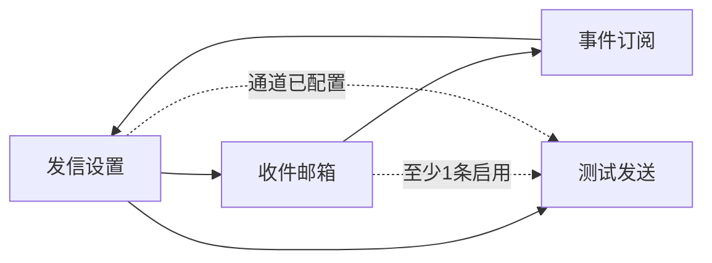

# UX: BOSS 通知设置 · 邮件通知

> Interaction specification derived from: `repo/services/tasks/modules/prd/boss/integration/prd-boss-email-notification.md`  
> Part of ani-workflow artifact triad — next: `/prd-to-spec`  
> Generated: 2026-07-10 | Revised: 2026-07-10 | Product: BOSS | UI stack: TDesign React + TanStack Router

## 1. Page Type

### 1.1 Classification

| Screen | Page type | In app shell? | Route |
|--------|-----------|---------------|-------|
| 发信设置 | 表单页（模板 E） | yes | `/integration/notification-settings/email/smtp` |
| 收件邮箱 | 资源列表页（模板 B） | yes | `/integration/notification-settings/email/recipients` |
| 事件订阅 | 配置页（模板 E，列表 + Switch） | yes | `/integration/notification-settings/email/subscriptions` |

三个子页同属 **邮件通知** 功能域，共享侧栏父级「通知设置」与统一 Breadcrumb 前缀。

### 1.2 Pattern Reference

- 信息架构：对齐腾讯云/火山/青云「通知设置分模块」——联系人、订阅、通道分开展示
- 发信设置：`UI规范/产品设计规范-页面模板-2.0.md` §8 表单页
- 收件邮箱：模板 B 列表页 + 抽屉；对齐 [`enterprise-notification.md`](../../../../docs/boss-modules/integration/enterprise-notification.md) 表格模式
- 事件订阅：模板 E；Switch 批量保存（非行内即时 PATCH）
- 壳层：BOSS App Shell（`Layout.Header` + `Layout.Aside` + `Layout.Content`）
- `[Assumption]` BOSS 前端尚未落地；本 UX 以 TDesign React 为默认实现栈

---

## 2. Information Architecture

### 2.1 Routes & Entry Points

| Route | Entry (nav / deep link / redirect) | Auth required |
|-------|-------------------------------------|---------------|
| `/integration/notification-settings/email/smtp` | 侧栏：通知设置 → 发信设置 | yes（平台管理员） |
| `/integration/notification-settings/email/recipients` | 侧栏：通知设置 → 收件邮箱 | yes |
| `/integration/notification-settings/email/subscriptions` | 侧栏：通知设置 → 事件订阅 | yes |
| `/integration/notification-settings/email` | 访问时 **redirect** → `/smtp` | yes |

建议 HTML 原型 ID（待同步 integration 域索引）：

| 子页 | HTML ID |
|------|---------|
| 发信设置 | `boss.integration.email.smtp` |
| 收件邮箱 | `boss.integration.email.recipients` |
| 事件订阅 | `boss.integration.email.subscriptions` |

### 2.2 Navigation Relationship

```text
BOSS App Shell
└── 平台集成与通知
    ├── 运维 Webhook
    ├── 企业通知集成（企微/钉钉 IM）
    ├── 通知设置                    ← 侧栏 SubMenu 父级
    │   ├── 发信设置                ← 邮件通知 · 子页 1
    │   ├── 收件邮箱                ← 邮件通知 · 子页 2
    │   └── 事件订阅                ← 邮件通知 · 子页 3
    └── 运营系统对接
```

- **侧栏：** `Menu.SubMenu` 标题「通知设置」；其下 3 个 `MenuItem`（发信设置 / 收件邮箱 / 事件订阅）
- **功能域名称：** 「邮件通知」体现在 Breadcrumb 与页头副标题，不作为侧栏第 4 级可点击项
- **Breadcrumb：** `平台集成与通知 / 通知设置 / 邮件通知 / {发信设置|收件邮箱|事件订阅}`
- **与 IM 页关系：** 发信设置页展示边界 `Alert`（IM 见「企业通知集成」）；收件人/订阅页可选简短提示

### 2.3 PRD Coverage Map

| PRD item | Screen / section |
|----------|------------------|
| US-001 配置 SMTP | 子页「发信设置」 |
| US-002 收件人列表 | 子页「收件邮箱」 |
| US-003 事件订阅 | 子页「事件订阅」 |
| US-004 测试发送 | 子页「发信设置」页头次操作 |
| US-005 联调 | 三子页均支持 `api_not_ready` / `forbidden` |
| FR-1 ~ FR-10 | 贯穿 §4–§7 |
| Non-Goals | §8.2 |

---

## 3. User Flow

### 3.1 Primary Flow（首次配通）

```text
侧栏进入「通知设置 → 发信设置」
  → 填写 SMTP 字段 →「保存通道」→ Message.success
  → 侧栏切换「收件邮箱」
  →「添加收件人」→ 抽屉填写邮箱/备注 → 保存 → 表格至少 1 条「启用」
  → 侧栏切换「事件订阅」
  → 打开所需事件 Switch →「保存订阅」→ Message.success
  → 回到「发信设置」→ 点击「发送测试邮件」
  → Message.success，提示查收邮箱
```

### 3.2 Secondary Flows

**测试发送前置不满足**

```text
在「发信设置」点击「发送测试邮件」（disabled）
  → Tooltip：请先完成发信通道配置，并在「收件邮箱」中添加至少一个启用的收件人
或 API 422/412
  → Message.warning，文案附链接提示跳转对应子页
```

**编辑 SMTP（已配置密码）**

```text
「发信设置」页
  → 密码框 placeholder「已配置，留空表示不修改」
  → 保存 → 不覆盖原密码
```

**停用收件人**

```text
「收件邮箱」表格操作列点击「停用」
  → Popconfirm 确认
  → 成功后状态 Tag 变为「停用」；行操作变为「启用」
  → 若全局无启用收件人：「发信设置」测试发送 disabled
```

**启用收件人**

```text
操作列点击「启用」→ 确认（可选 Popconfirm）→ Tag 变为「启用」
```

**无写权限（只读）**

```text
三子页均可进入查看
  → 表单/表格/Switch disabled；隐藏保存、添加、测试发送
  → 顶部 Alert：当前账号仅可查看
```

**API / 契约未就绪**

```text
GET 失败 501 / NOT_IMPLEMENTED
  → 当前子页 Alert：邮件通知 API 尚未就绪
  → 不展示伪造数据
```

### 3.3 Flow Diagram



---

## 4. Layout Regions

### 4.1 子页一：发信设置

```text
┌─────────────────────────────────────────────────────────────┐
│ Breadcrumb: 平台集成与通知 / 通知设置 / 邮件通知 / 发信设置    │
├─────────────────────────────────────────────────────────────┤
│ Page Header                                                  │
│  标题：发信设置                                               │
│  副标题：邮件通知 · 配置平台 SMTP 发信通道                     │
│  操作：[发送测试邮件]（outline）                               │
├─────────────────────────────────────────────────────────────┤
│ Alert（info）：企微/钉钉见「企业通知集成」                     │
├─────────────────────────────────────────────────────────────┤
│ Form（SMTP）                                                 │
│  host / port / 加密 / 发件地址 / 账号 / 密码                  │
│ Footer: [保存通道]（primary）                                 │
└─────────────────────────────────────────────────────────────┘
```

### 4.2 子页二：收件邮箱

```text
┌─────────────────────────────────────────────────────────────┐
│ Breadcrumb: ... / 邮件通知 / 收件邮箱                          │
├─────────────────────────────────────────────────────────────┤
│ Page Header                                                  │
│  标题：收件邮箱                                               │
│  副标题：邮件通知 · 管理全局收件人；已开启订阅的事件将发往      │
│         所有「启用」状态的收件邮箱                              │
│  操作：[添加收件人]（primary）                                 │
├─────────────────────────────────────────────────────────────┤
│ Table                                                        │
│  邮箱 | 备注 | 状态(Tag) | 操作(编辑 / 停用|启用 / 删除)        │
└─────────────────────────────────────────────────────────────┘
```

### 4.3 子页三：事件订阅

```text
┌─────────────────────────────────────────────────────────────┐
│ Breadcrumb: ... / 邮件通知 / 事件订阅                          │
├─────────────────────────────────────────────────────────────┤
│ Page Header                                                  │
│  标题：事件订阅                                               │
│  副标题：邮件通知 · 选择哪些平台事件发送邮件                   │
├─────────────────────────────────────────────────────────────┤
│ Table / List（固定 5 行，无分页）                              │
│  事件名称 | 说明 | 邮件通知(Switch)                            │
│ Footer: [保存订阅]（primary，有变更才可点）                    │
└─────────────────────────────────────────────────────────────┘
```

### 4.4 Region 明细

| Screen | Region | Content | Notes |
|--------|--------|---------|-------|
| 发信设置 | Page Header | 标题、副标题、测试发送 | 测试发送仅在此页 |
| 发信设置 | 边界 Alert | IM vs Email | info，可关闭 |
| 发信设置 | Form | SMTP 全字段 | 手动保存 |
| 收件邮箱 | Page Header | 标题、说明、添加收件人 | — |
| 收件邮箱 | Table | 列表 + 操作列 | **无行内 Switch** |
| 收件邮箱 | Drawer | 添加/编辑 | 仅邮箱、备注；不含启用 Switch |
| 事件订阅 | Table/List | 5 事件 + Switch | 批量保存 |
| 事件订阅 | Footer | 保存订阅 | dirty 才可点 |

---

## 5. Component Mapping

> 字段名对齐未来 Core OpenAPI schema；SPEC 阶段以 YAML 为准。

### 5.1 发信设置

| UI element | TDesign component | Props / variant | Data source |
|------------|-------------------|-----------------|-------------|
| SMTP 主机 | `Input` | `name="smtp_host"`, required | 用户输入 |
| SMTP 端口 | `InputNumber` | min=1, max=65535 | 用户输入 |
| 加密方式 | `Select` | STARTTLS / SSL / 无 | 用户选择 |
| 发件人地址 | `Input` | type=email, required | 用户输入 |
| 登录账号 | `Input` | — | 用户输入 |
| 登录密码 | `Input` | type=password；placeholder「已配置，留空表示不修改」 | 仅写入 |
| 通道状态 | `Tag` | success=已配置 / default=未配置 | API（若返回） |
| 保存通道 | `Button` | theme=primary | — |
| 测试发送 | `Button` | variant=outline, disabled+Tooltip | 前置条件 |
| 表单 | `Form` | layout=vertical | — |

### 5.2 收件邮箱

| UI element | TDesign component | Props / variant | Data source |
|------------|-------------------|-----------------|-------------|
| 添加收件人 | `Button` | theme=primary | — |
| 表格 | `Table` | — | API list |
| 邮箱列 | column | `email` | API |
| 备注列 | column | `label` | API |
| 状态列 | `Tag` | theme=success「启用」/ default「停用」 | API `enabled` |
| 编辑 | `Button` | variant=text | 打开抽屉 |
| 停用 | `Button` + `Popconfirm` | variant=text | PATCH enabled=false |
| 启用 | `Button` + `Popconfirm`（可选） | variant=text | PATCH enabled=true |
| 删除 | `Button` + `Popconfirm` | theme=danger, variant=text | DELETE |
| 空态 | `Empty` | +「添加收件人」CTA | — |
| 抽屉 | `Drawer` | 480px | 添加/编辑 |
| 抽屉表单 | `Form` | email（必填）、label（选填） | **不含启用 Switch** |

### 5.3 事件订阅

| UI element | TDesign component | Props / variant | Data source |
|------------|-------------------|-----------------|-------------|
| 事件表 | `Table` | 无分页，5 行 | API + 枚举 |
| 邮件开关 | `Switch` | 对齐 `event_type` | 用户切换 |
| 保存订阅 | `Button` | primary；无 dirty 则 disabled | — |

**首期事件枚举：**

| 展示名 | event_type（占位） |
|--------|-------------------|
| 平台告警 P0 | `platform_alert_p0` |
| 平台告警 P1 | `platform_alert_p1` |
| Incident 创建 | `incident_created` |
| Incident 升级 | `incident_escalated` |
| 平台关键任务失败 | `platform_task_failed` |

### 5.4 侧栏与全局

| UI element | TDesign component | Props / variant | Notes |
|------------|-------------------|-----------------|-------|
| 通知设置父级 | `Menu.SubMenu` | title=通知设置 | 可展开 |
| 子菜单项 | `MenuItem` | 3 项 | 高亮当前路由 |
| 反馈 | `Message` / `Alert` | — | 各子页 |
| 无权限 | `Alert` / `Result` | theme=warning / 403 | — |
| API 未就绪 | `Alert` | theme=warning | 各子页 |

---

## 6. State Design

### 6.1 发信设置

| State | Trigger | UI behavior | Components |
|-------|---------|-------------|------------|
| loading | GET 通道配置中 | Form skeleton | `Skeleton` |
| empty | 未配置 | 空白表单 | `Form` |
| configured | 已有配置 | 回填；密码不回显 | `Form` |
| submitting | 保存中 | 按钮 loading | `Button` |
| error | API 失败 | Message.error | `Message` |
| success | 保存成功 | Message.success | `Message` |
| api_not_ready | 501 等 | Alert；无保存 | `Alert` |
| forbidden | 403 | Result 403 | `Result` |
| read_only | 无 write | 表单 disabled | — |

### 6.2 收件邮箱

| State | Trigger | UI behavior | Components |
|-------|---------|-------------|------------|
| loading | list 请求中 | Table loading | `Table` |
| empty | 无数据 | Empty + CTA | `Empty` |
| idle | 有数据 | Table + Tag 状态 | `Table`, `Tag` |
| drawer_open | 添加/编辑 | 抽屉打开 | `Drawer` |
| deactivating | 停用确认后 | 行 loading 或全局 loading | — |
| error | 失败 | Message.error | `Message` |
| success | 增删改/启停成功 | Message.success；刷新表格 | `Message` |

**状态列规则：**

- `enabled=true` → `Tag theme="success"` 文案「启用」；操作：编辑、停用、删除
- `enabled=false` → `Tag theme="default"` 文案「停用」；操作：编辑、启用、删除
- **禁止** 表格行内 `Switch`

### 6.3 事件订阅

| State | Trigger | UI behavior | Components |
|-------|---------|-------------|------------|
| loading | GET 订阅中 | Skeleton | `Skeleton` |
| idle | 加载成功 | Switch 展示 API 值 | `Switch` |
| dirty | Switch 有变更 | 「保存订阅」enabled | `Button` |
| submitting | 保存中 | 按钮 loading；Switch disabled | `Button` |
| error / success | API 响应 | Message | `Message` |

### 6.4 测试发送（发信设置页）

| State | Trigger | UI behavior | Components |
|-------|---------|-------------|------------|
| disabled | 通道未配或无启用收件人 | Button disabled + Tooltip | `Tooltip` |
| ready | 前置满足 | 可点击 | `Button` |
| sending | 请求中 | loading | `Button` |
| success | 200/202 | Message.success | `Message` |
| error | 失败 | Message.error + request_id | `Message` |

---

## 7. Copy & Feedback

### 7.1 Labels & Buttons

| Element | Copy (zh-CN) | Notes |
|---------|--------------|-------|
| 侧栏父级 | 通知设置 | SubMenu |
| 功能域（Breadcrumb） | 邮件通知 | 非侧栏可点击项 |
| 子页 1 标题 | 发信设置 | — |
| 子页 2 标题 | 收件邮箱 | — |
| 子页 3 标题 | 事件订阅 | — |
| 页头副标题前缀 | 邮件通知 · | 三页统一 |
| 保存通道 | 保存通道 | primary |
| 添加收件人 | 添加收件人 | primary |
| 保存订阅 | 保存订阅 | primary |
| 发送测试邮件 | 发送测试邮件 | outline |
| 状态 Tag 启用 | 启用 | success |
| 状态 Tag 停用 | 停用 | default |
| 操作-编辑 | 编辑 | text |
| 操作-停用 | 停用 | text + Popconfirm |
| 操作-启用 | 启用 | text |
| 操作-删除 | 删除 | danger + Popconfirm |
| 边界 Alert | 本页用于邮件通知。企业微信/钉钉 Bot 请在「企业通知集成」中配置。 | 发信设置页 |

### 7.2 Messages

| Scenario | Type | Copy |
|----------|------|------|
| 通道保存成功 | `Message.success` | 发信通道已保存 |
| 收件人保存成功 | `Message.success` | 收件人已保存 |
| 收件人已停用 | `Message.success` | 收件人已停用 |
| 收件人已启用 | `Message.success` | 收件人已启用 |
| 收件人删除成功 | `Message.success` | 收件人已删除 |
| 停用确认 | `Popconfirm` | 停用后该邮箱将不再接收邮件通知，是否继续？ |
| 删除确认 | `Popconfirm` | 删除后不可恢复，是否继续？ |
| 订阅保存成功 | `Message.success` | 事件订阅已保存 |
| 测试发送成功 | `Message.success` | 测试邮件已发送，请查收启用中的收件邮箱 |
| 测试发送失败 | `Message.error` | 测试发送失败：{message}（请求 ID：{request_id}） |
| 测试前置不足 | `Tooltip` | 请先配置发信通道，并在「收件邮箱」中添加至少一个启用的收件人 |
| API 未就绪 | `Alert` | 邮件通知接口尚未就绪，配置暂不可保存 |
| 无写权限 | `Alert` | 当前账号仅可查看，无法修改邮件通知配置 |

---

## 8. Boundaries & Non-Goals

### 8.1 In Scope (UX)

- 侧栏「通知设置」下 3 个子页：发信设置、收件邮箱、事件订阅
- Breadcrumb 体现「邮件通知」功能域
- 收件人表格：Tag 状态 + 操作列（编辑/停用/启用/删除），无行内 Switch
- 测试发送在发信设置页
- 全状态：loading / empty / error / forbidden / api_not_ready

### 8.2 Explicitly Out of Scope

- 单页三 Card 纵向堆叠（已废弃）
- 表格行内 Switch 启停收件人
- 抽屉内启用/停用 Switch（启停仅操作列）
- 邮件模板编辑、云厂商 API、投递历史、按事件绑收件人
- Console 租户侧、企微/钉钉合并进本功能

### 8.3 Decisions（已决议）

| 议题 | 决议 |
|------|------|
| 页面形态 | 侧栏 3 子页，对齐大厂分模块习惯 |
| 侧栏 IA | 父级「通知设置」+ 3 子项；「邮件通知」为 Breadcrumb 功能域名 |
| 收件人启停 | Tag 展示状态；操作列编辑/停用/启用；无行内 Switch |

### 8.4 Assumptions

- 新建收件人默认 `enabled=true`（API 层默认，抽屉不提供 Switch）
- 事件订阅 Switch 仍为批量保存（非即时 PATCH）
- `/integration/notification-settings/email` redirect 至 `/smtp`
- 邮箱验证（青云/腾讯模式）为 P2，本期仅启用/停用 Tag
