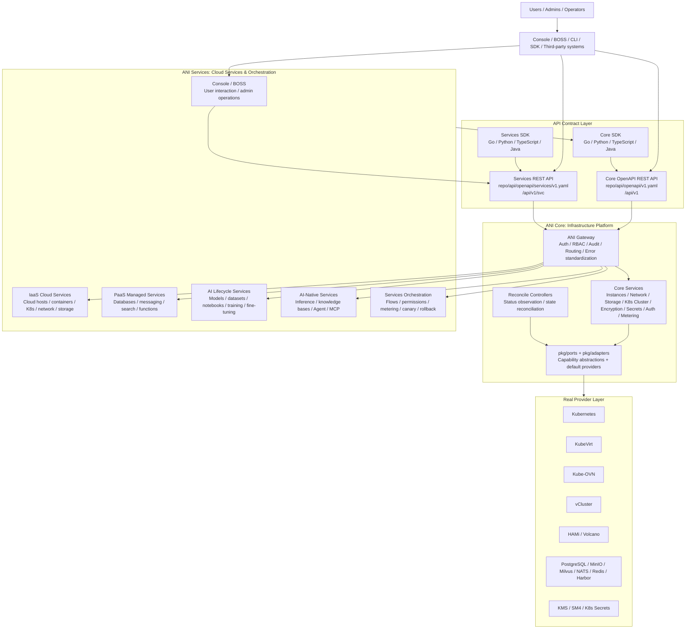

# ANI Architecture Overview

## Two-Layer Architecture

ANI is an AI Private Cloud platform split into two strict layers:

1. **ANI Core** — Infrastructure control plane. Manages compute instances (VM, container, GPU, sandbox, K8s cluster), network (VPC, subnet, security groups), storage (block, file, object, vector), identity/auth/RBAC, observability, metering, async tasks, quota, and reconcile controllers. Written in Go. Communicates via Core OpenAPI REST API and internal gRPC.

2. **ANI Services** — Cloud services and user-facing orchestration layer. Provides model registry, inference services, knowledge bases, RAG engine, PaaS hosting, Console/BOSS frontends, and AI-native applications. Uses Go (gRPC), Python (AI services), and TypeScript (frontends). Consumes Core capabilities exclusively through Core OpenAPI/SDK — never through direct code imports.

## Architecture Diagram

## Key Architectural Rules

1. **Two separate API contracts**: Core API (`/api/v1`) and Services API (`/api/v1/svc`) are distinct OpenAPI specs with separate SDKs.
2. **Directional dependency**: Services may use Core SDK; Core must never import Services code.
3. **Gateway routing split**: Core routes (`/api/v1/*`) and Services routes (`/api/v1/svc/*`) are registered in the same Gateway process but owned by different teams.
4. **Ports/adapters**: All infrastructure capabilities are abstracted through `pkg/ports/` interfaces with default `pkg/adapters/` implementations. No service code depends on specific provider SDKs.
5. **API-first development**: Changes start in the OpenAPI spec, then handler implementation, then SDK generation, then validation gate.

## References

- [Core vs Services Boundary](core-vs-services-boundary.md) — Strict boundary rules
- [Ports and Adapters](ports-and-adapters.md) — Capability abstraction pattern
- [Tech Stack](tech-stack.md) — Technology selection decisions
- ANI-05: System Architecture Design (repo root `ANI-05-系统架构设计.md`)
- [Core Overview](../core/overview.md) — Core platform capabilities
- [Services Layer Overview](../services-layer/overview.md) — Services capabilities