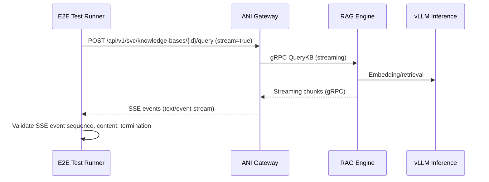

# End-to-End Integration Tests

**Directory**: `repo/tests/e2e/`

## SSE Streaming E2E Test

**File**: `run_e2e_sse_test.py` (15.7KB)

This test orchestrates three real services to validate the complete SSE streaming path:



Covers: KB document upload → parse → embed → index → streaming query → SSE response delivery through Gateway proxy.

## Fake RAG Engine

**File**: `fake_rag_engine.py` (1.4KB)

Lightweight RAG engine replacement for isolated SSE endpoint testing without real RAG engine dependencies. Returns controlled streaming responses for deterministic test assertions.

## Running

```bash
# Run all E2E tests
cd repo && make test-e2e

# Run SSE-specific E2E test
cd repo/tests/e2e && python run_e2e_sse_test.py
```

## References

- [KB Service](../services-layer/kb-service.md) — Knowledge base gRPC service
- [RAG Engine](../ai-services/rag-engine.md) — Python RAG engine
- [Inference](../services-layer/inference.md) — Inference contracts
- [Validation Gates](validation-gates.md) — Live gate catalog