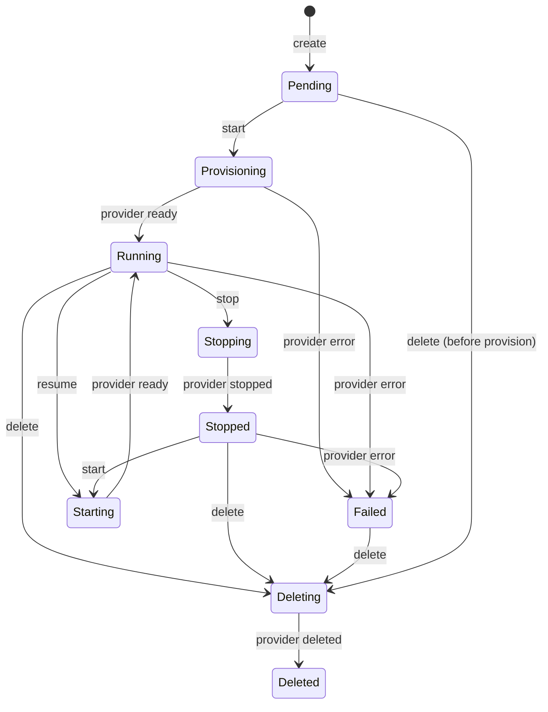

# Instance Lifecycle

## Workload State Machine

The workload instance lifecycle follows a strict state machine defined by `WorkloadState` constants:



All 9 states: `Pending`, `Provisioning`, `Starting`, `Running`, `Stopping`, `Stopped`, `Failed`, `Deleting`, `Deleted`.

## Lifecycle Actions

23 lifecycle actions defined in `WorkloadLifecycleAction`: `create`, `start`, `stop`, `restart`, `resize`, `rebuild`, `delete`, `snapshot`, `attach_volume`, `detach_volume`, `attach_filesystem`, `detach_filesystem`, `rollback`, `scale`, `update_image`, `bind_secret`, `unbind_secret`, `change_security_groups`, `set_termination_protection`, `pause`, `resume`, `extend`, `touch_idle`, `console_session`.

## Orchestrator Pipeline

`LocalInstanceOrchestrator` implements the 8-step instance orchestration pipeline:

1. **Runtime.Create** (`ports.WorkloadRuntime`) — create workload definition
2. **Renderer.Render** (`ports.WorkloadRenderer`) — generate provider-specific manifests (K8s YAML, KubeVirt VM spec, etc.)
3. **Admission.Review** (`ports.WorkloadAdmission`) — validate against admission guardrails
4. **Audit.RecordPlan** (`ports.WorkloadPlanAuditStore`) — log the plan before execution
5. **DryRun.DryRun** (`ports.WorkloadProviderDryRun`) — server-side dry-run against real provider
6. **Apply.Apply** (`ports.WorkloadProviderApply`) — apply manifests to provider
7. **Reader.Observe** (`ports.WorkloadProviderStatusReader`) — read back provider status
8. **Reconciler.Reconcile** (`ports.WorkloadStatusReconciler`) — reconcile stored state with observed state

All 8 dependencies are validated non-nil by `Orchestrator.validate()` before any lifecycle operation.

## Status Reconciliation

`LocalStatusReconciler` (implements `WorkloadStatusReconciler`) maps provider-level phase strings to canonical `WorkloadState`:

- Provider phases like `"ready"`, `"running"`, `"available"` → `Running`
- `"pending"`, `"provisioning"` → `Provisioning`
- `"crashloopbackoff"`, `"error"`, `"failed"` → `Failed`
- `"stopping"` → `Stopping`
- `"stopped"`, `"terminated"` → `Stopped`
- `"deleting"` → `Deleting`
- `"deleted"` → `Deleted`

The mapping is extensible per-provider via provider-specific override rules.

## In-Memory Instance Store (`memoryInstanceStore`)

The Gateway router (`services/ani-gateway/internal/router/instances.go`) uses an in-memory instance store for dev/test scenarios. The composite key is `tenantID + "/" + instanceID`, and `List` filters by `tenantID` to enforce tenant isolation.

### Cross-Tenant Isolation

Tests verify cross-tenant isolation:

- **Volume isolation**: `TestStorageAPIServiceKeepsTenantIsolation` proves that a tenant-b cannot `Get` a volume owned by tenant-a
- **Instance isolation**: The in-memory instance store's composite key structure (`tenantID + "/" + instanceID`) prevents cross-tenant access by design

## Reconcile Controller Loop

`LocalWorkloadReconcileController` runs a continuous reconciliation loop:

```
Every NormalIntervalSeconds (30s) or ActiveIntervalSeconds (5s for active instances):
  1. List all non-terminal instances via MetadataInstanceStore
  2. For each instance:
     a. Call WorkloadProviderStatusReader.Observe(tenantID, instanceID)
     b. Compare observed status with stored status
     c. If different, call WorkloadStatusReconciler.Reconcile(ctx, record, observation)
     d. If reconciled state differs from stored state, call WorkloadInstanceStore.UpsertStatus
  3. Apply backoff: reconcile_retry_backoff for transient errors
```

### ProviderMissing Detection

When `WorkloadProviderStatusReader.Observe` returns `ErrNotFound` (provider resource deleted out-of-band), the controller:
1. Marks the instance as `Failed`
2. Sets the reason to `"ProviderResourceLost"`
3. Updates the instance store via `UpsertStatus`

This is verified in test `TestReconcileProviderResourceLost` in `reconcile_controller_test.go`.

## HA Leader Election

For multi-replica deployments, `MetadataReconcileLeaderElector` provides Postgres-backed leader election:
- Lease table: `control_plane_leases`
- Configurable: lease name, identity, TTL (seconds), renew interval
- Only the leader runs the reconcile controller loop
- Follower replicas are ready but idle until leader lease expires

## References

- [Ports Catalog](ports-catalog.md) — WorkloadRuntime, WorkloadRenderer, WorkloadAdmission, etc.
- [Reconcile Controller](reconcile-controller.md) — Detailed controller loop documentation
- [Gateway](gateway.md) — Instance handler wiring
- [Network](network.md) — Network attachment model
- [Storage](storage.md) — Storage attachment model
- Source: `pkg/ports/workload_runtime.go`, `pkg/adapters/runtime/instance_orchestrator.go`, `pkg/adapters/runtime/status_reconciler.go`, `pkg/adapters/runtime/reconcile_controller.go`