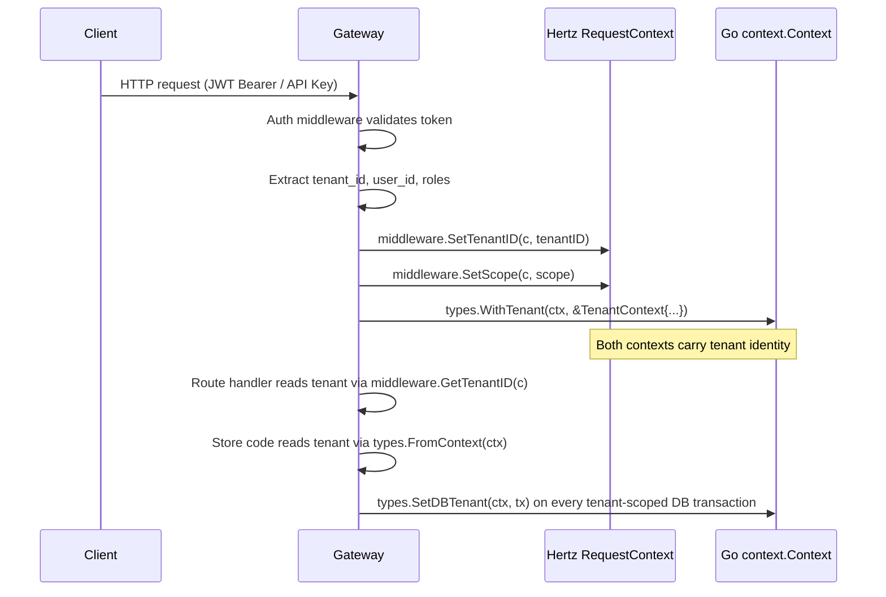

# Tenant Context Propagation

## Overview

Tenant identity flows through the system differently depending on the protocol boundary. There is **no single gRPC unary interceptor** for tenant context — the architecture splits propagation into two paths:

| Protocol | Context Mechanism | Tenant Source |
|----------|-------------------|---------------|
| **HTTP (Gateway)** | Hertz `RequestContext` + Go `context.Context` with `TenantContext` | Auth middleware (JWT / API Key / sandbox token) |
| **gRPC (Services/Core)** | Protobuf message fields (e.g., `req.TenantId`) | Gateway proxy sets from HTTP tenant context before forwarding |
| **PostgreSQL RLS** | `SET LOCAL app.current_tenant_id` | Store code calls `types.SetDBTenant(ctx, tx)` inside every tenant-scoped transaction |

## TenantContext Struct

**File**: `pkg/types/tenant.go`

```go
type TenantContext struct {
    TenantID uuid.UUID   // always set after authentication
    UserID   uuid.UUID   // zero UUID for API Key auth
    Roles    []string    // e.g. ["tenant-admin", "user"]
}
```

### Context Functions

| Function | Behavior |
|----------|----------|
| `WithTenant(ctx, tc)` | Injects `TenantContext` into Go context (called by Auth middleware after JWT/API key validation) |
| `FromContext(ctx)` | Extracts — **panics** if absent (programming-error guard, used in store code that requires tenant context) |
| `TryFromContext(ctx)` | Safe extraction — returns `(nil, false)` if absent |
| `SetDBTenant(ctx, tx)` | Executes `SELECT set_config('app.current_tenant_id', $1, true)` via `SET LOCAL` on the transaction. Called inside every `WithTenantTx` wrapper |

## HTTP Path (Gateway → Services)



**Note**: The Hertz `RequestContext` carries `tenant_id` as a string (accessible via `middleware.GetTenantID(c)`). The Go `context.Context` carries the full `TenantContext` struct. Both are set by the Auth middleware and must be consistent.

## gRPC Path (Gateway → Service)

The Gateway's HTTP→gRPC proxy (e.g., `tenant_plans.go` router) forwards tenant identity as **protobuf request fields**, not gRPC metadata:

```go
// Gateway router extracts tenant_id from Hertz context
tenantID := middleware.GetTenantID(c)

// Then passes it as a message field
req := &tenantv1.BindPlanQuotaRequest{
    TenantId: tenantID,
    PlanId:   planID,
    IdempotencyKey: idempotencyKey,
}
```

This means:

- Services-layer gRPC servers (`services/pkg/bootstrap/server.go`) have **no tenant-unary-interceptor** — only `loggingUnaryInterceptor` and `recoveryUnaryInterceptor`
- Core-layer gRPC servers (`pkg/bootstrap/server.go`) similarly have no tenant interceptor
- Tenant-aware stores in the Services layer receive tenant context via `types.WithTenant(ctx, ...)` **only** when the caller sets it explicitly (the Gateway proxy does this before each gRPC call)

## PostgreSQL RLS Integration

Every tenant-scoped table's RLS policy reads `app.current_tenant_id`:

```sql
CREATE POLICY tenant_isolation ON resource_quota
    FOR ALL
    USING (tenant_id = current_setting('app.current_tenant_id')::uuid);
```

The `ani_app` database role has RLS **enabled** (it is NOT a superuser or BYPASSRLS role). The `ani_outbox_publisher` role has **BYPASSRLS** for cross-tenant outbox scanning.

### How `SetDBTenant` Works

```go
func SetDBTenant(ctx context.Context, tx pgx.Tx) error {
    tc := FromContext(ctx)  // panics if no TenantContext
    _, err := tx.Exec(ctx,
        "SELECT set_config('app.current_tenant_id', $1, true)",
        tc.TenantID.String(),
    )
    return err
}
```

The `SET LOCAL` scope ensures the variable is **transaction-scoped** — it cannot leak across connections in PgBouncer's transaction pooling mode.

## Tenant Identity Flow Summary

```text
HTTP Request
  │
  ├─ Auth middleware
  │    ├─ Hertz ctx:  tenant_id (string), scope (string)
  │    └─ Go ctx:     TenantContext{TenantID, UserID, Roles}
  │
  ├─ Gateway HTTP handler
  │    └─ Reads: middleware.GetTenantID(c), types.FromContext(ctx)
  │
  ├─ Gateway → gRPC proxy
  │    └─ Tenant ID → protobuf message field (not gRPC metadata)
  │
  ├─ Services gRPC handler
  │    ├─ Receives: req.TenantId (string)
  │    └─ Wraps context: types.WithTenant(ctx, &TenantContext{TenantID: parsedTenantID})
  │
  └─ Store (PostgreSQL)
       └─ types.SetDBTenant(ctx, tx) → SET LOCAL app.current_tenant_id
            └─ RLS policy filters rows by tenant_id
```

## References

- [Auth & Security](auth-security.md) — Auth middleware, JWT, API Keys
- [Middleware Chain](middleware.md) — Middleware composition and order
- [Quota & Tenancy](quota-tenancy.md) — RLS policies and cross-tenant isolation
- Source: `pkg/types/tenant.go` — `TenantContext` struct and context functions
- Source: `services/ani-gateway/internal/middleware/auth.go` — Auth middleware (where context is set)
- Source: `services/ani-gateway/internal/router/tenant_plans.go` — Example HTTP→gRPC proxy routing