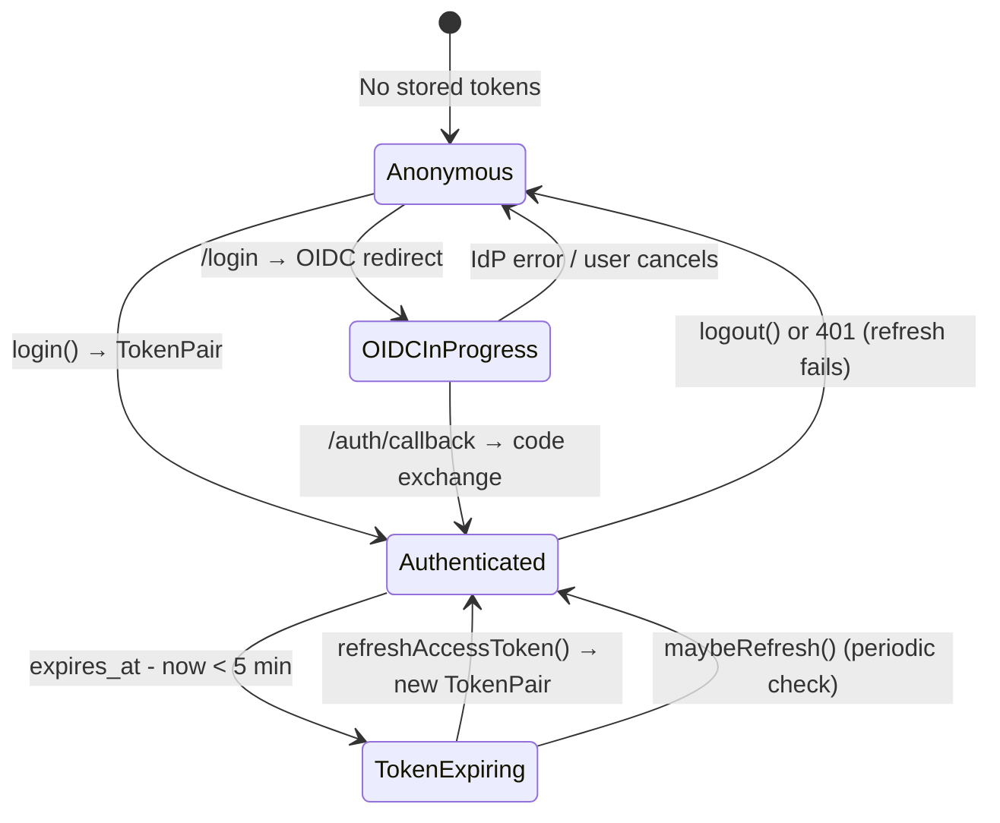

# Frontend Auth & Session Management

## Session Architecture

Both the **Console** (`frontends/console/`) and **BOSS** (`frontends/boss/`) frontends use an identical session module with a `KEY_PREFIX` to isolate storage:

| Frontend | Prefix | File |
|----------|--------|------|
| Console | `console:` | `frontends/console/src/auth/session.ts` |
| BOSS | `boss:` | `frontends/boss/src/auth/session.ts` |

## Storage Strategy

| Storage | Lifetime | Used When |
|---------|----------|-----------|
| `localStorage` | Persistent across tabs/browser restarts | User checked "Remember Me" |
| `sessionStorage` | Per-tab, cleared on tab close | Default (no "Remember Me") |

### Session Keys

| Key | Value Type | Purpose |
|-----|-----------|---------|
| `{prefix}access_token` | string | JWT Bearer token |
| `{prefix}refresh_token` | string | Long-lived refresh token |
| `{prefix}expires_at` | number (ms epoch) | Access token expiry timestamp |
| `{prefix}remember_me` | `'true'` | Storage medium selection flag |
| `{prefix}oidc_state` | string | OIDC flow state (sessionStorage only) |
| `{prefix}return_to` | string | Pre-auth URL for redirect after login |

### Key Types

```typescript
interface TokenPair {
  access_token: string
  refresh_token: string
  expires_in: number        // seconds from issuance
  issued_at?: string        // ISO 8601 (preferred) or absent (falls back to Date.now())
}

interface SessionState {
  access_token: string
  refresh_token: string
  expires_at: number        // ms epoch, computed as issued_at + expires_in * 1000
  remember_me: boolean
}
```

## Session Lifecycle



### Login Flow

1. User visits `/login` page
2. **OIDC tab**: Redirects to IdP with `OIDC_STATE_KEY` + `RETURN_TO_KEY` stored in sessionStorage
3. **Password tab**: `POST /api/v1/auth/password-login` → receives `TokenPair`
4. `saveSession(pair, remember)` writes tokens to the selected storage medium
5. On storage medium **switch** (changing "remember me" between sessions), old-medium keys are cleaned up

### Expiry Calculation

```typescript
function computeExpiresAt(pair: TokenPair): number {
  const issuedAtMs = pair.issued_at ? Date.parse(pair.issued_at) : Date.now()
  if (Number.isNaN(issuedAtMs)) return Date.now() + pair.expires_in * 1000
  return issuedAtMs + pair.expires_in * 1000
}
```

## Token Refresh

### Silent Refresh

Both frontends implement a **proactive silent refresh** mechanism:

```typescript
export const REFRESH_THRESHOLD_MS = 5 * 60 * 1000  // 5 minutes
```

| Trigger | Action |
|---------|--------|
| `maybeRefresh()` on route entry (`_authenticated.tsx` beforeLoad) | If `expires_at - now < 5 min` → calls `POST /auth/refresh` with refresh token |
| `setInterval(maybeRefresh, 60s)` in authenticated layout | Periodic check every 60 seconds |
| API response 401 handler | If not an auth endpoint → calls `refreshAccessToken()` → if that also 401 → `handle401()` |

### Refresh Flow

```text
1. Check remaining time: expires_at - now < REFRESH_THRESHOLD_MS?
   No  → OK, no-op
   Yes → continue
2. POST /auth/refresh { refresh_token: session.refresh_token }
   ├─ 200 → saveSession({ access_token: new, ... }, session.remember_me)
   │         setAuthToken(new access_token)
   │         return true
   └─ 401 → handle401() → clearSession() → redirect /login?returnTo=...
```

### Concurrency Guard

`refreshAccessToken()` uses a `refreshing` promise guard to prevent concurrent refresh calls:

```typescript
let refreshing: Promise<boolean> | null = null
// subsequent calls during in-flight refresh return the same promise
```

## Route Protection

### `_authenticated.tsx` (pathless layout route)

Uses TanStack Router's `beforeLoad` guard:

```typescript
export const Route = createFileRoute('/_authenticated')({
  beforeLoad: async ({ location }) => {
    const session = getSession()
    if (!session || !isSessionValid()) {
      saveReturnTo(location.pathname + location.searchStr)
      throw redirect({ to: '/login', search: { returnTo: current } })
    }
    await maybeRefresh()          // silent refresh if near expiry
    setAuthToken(session.access_token)  // inject Bearer into API client
  },
  component: AuthenticatedLayout, // sidebar + header + <Outlet />
})
```

**Public routes** (not under `_authenticated`):
| Path | Description |
|------|-------------|
| `/login` | Login page (OIDC + password) |
| `/auth/callback` | OIDC callback handler |

**Protected routes** (under `_authenticated`):
All application routes: `/`, `/compute/gpu`, `/gpu-inventory`, `/kb`, `/settings/*`, etc.

### `isSessionValid()` Check

Returns `false` when:
- No `access_token` in storage
- No `refresh_token` in storage
- `expires_at` is NaN or Infinity
- Both access token AND refresh token have expired (no renewal possible)

## OIDC State Management

| Storage Key | Written At | Consumed At |
|-------------|-----------|-------------|
| `{prefix}oidc_state` | OIDC begin (before IdP redirect) | OIDC callback (state parameter verification) |
| `{prefix}return_to` | Before redirect to login | After successful auth (redirect to original URL) |

OIDC state is always stored in `sessionStorage` regardless of remember-me preference, ensuring it is cleaned up when the tab closes.

## 401 Interceptor

The `response401Middleware` in `auth.ts`:
1. Skips auth endpoints (`/auth/login`, `/auth/refresh`, `/auth/logout` etc.) to prevent infinite redirect
2. Attempts silent refresh via `refreshAccessToken()`
3. If refresh succeeds → caller retries original request
4. If refresh fails → `handle401()` → `clearSession()` → redirect to `/login?returnTo=...`

## References

- [Console Frontend](console.md) — Route structure and feature pages
- [BOSS Frontend](boss.md) — Admin frontend
- [Auth & Security](../core/auth-security.md) — Server-side auth, JWT, API keys
- Source: `frontends/console/src/auth/session.ts`
- Source: `frontends/console/src/api/auth.ts`
- Source: `frontends/console/src/routes/_authenticated.tsx`