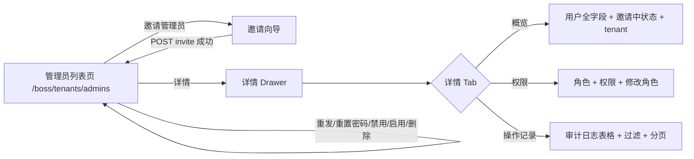

# UX: 租户管理员管理

> Interaction specification derived from: [PRD: 租户管理员管理](../../prd/boss/tenant/prd-new-boss-tenant-admin.md)
> Plan 参考：[租户管理 plan v3.0](../../plan/tenant/租户管理plan%20v3.0.md) §4.1.4 / §5.4.1~5.4.12 / §7.3.4 / §7.4
> 产品原型：`产品原型-7.23/index.html`（`/boss/tenants/admins` 页面 + 租户详情「管理员」Tab）与 `boss-tenant-闭环.html` 闭环 C
> Part of ani-workflow artifact triad — next: `/prd-to-spec`
> Generated: 2026-08-07 | Product: BOSS | UI stack: TDesign React + TanStack Router + TanStack Query

---

## 1. Page Type

### 1.1 Classification

| Screen | Page type | In app shell? | Route |
|--------|----------|---------------|-------|
| 跨租户管理员列表（租户管理员管理主页） | list | yes | `/boss/tenants/admins` |
| 邀请管理员 | dialog (in-list 向导) | yes | `/boss/tenants/admins`（Dialog 浮层） |
| 重发邀请 | dialog + Popconfirm (in-list) | yes | `/boss/tenants/admins`（Dialog 浮层） |
| 管理员详情 | drawer | yes | `/boss/tenants/admins`（Drawer 浮层，不单独走路由） |
| 修改权限 | dialog (in-drawer) | yes | 详情 Drawer「权限」Tab 内 |
| 重置密码 | dialog (in-list) | yes | `/boss/tenants/admins`（Dialog 浮层） |
| 禁用 / 启用 / 删除 | inline action + Popconfirm | yes | `/boss/tenants/admins` 行操作 |
| 管理员权限查询 | read section (drawer) | yes | 详情 Drawer「权限」Tab |
| 管理员操作历史 | list (drawer tab) | yes | 详情 Drawer「操作记录」Tab |

### 1.2 Pattern Reference

复用 BOSS 现有「收件邮箱」页（`src/routes/integration/notification-settings/email/recipients.tsx`）与「配额套餐」页的 **列表 + Drawer/Dialog** 模式：
- 路由页管 query/mutation/drawer 开关
- Table 与 Drawer/Dialog 拆成独立组件
- 写操作 body 带 `idempotency_key`（前端 `crypto.randomUUID()` 生成，对用户不可见），成功后 `invalidateQueries` 刷新

---

## 2. Information Architecture

### 2.1 Routes & Entry Points

| Route | Entry (nav / deep link / redirect) | Auth required |
|-------|-------------------------------------|---------------|
| `/boss/tenants/admins` | 侧栏「租户管理 → 租户管理员」菜单项 | yes（platform-admin / platform-ops / platform-readonly） |

### 2.2 Navigation Relationship

```
侧栏菜单
└── 租户管理（SubMenu）
    ├── 租户列表      /boss/tenants
    ├── 配额策略      /boss/tenants/plans
    └── 租户管理员    /boss/tenants/admins          ← 本页面（跨租户）
```

需在 `_authenticated.tsx` 的 `Menu` 下新增 `Menu.SubMenu value="tenant"` 及三个 `Menu.MenuItem`。当前 `_authenticated.tsx` 尚无「租户管理」菜单，需新增。

- 跨租户入口：`/boss/tenants/admins`（跨租户 `GET /tenant-admins`，仅返回租户管理员/邀请中/已过期邀请的用户，可按租户过滤）

> 顶部「租户选择器」两个职责：① 作为跨租户列表 `tenant_id` 过滤条件；② 作为「邀请管理员」向导的目标租户。

### 2.3 PRD Coverage Map

| PRD item | Screen / section |
|----------|------------------|
| US-001 邀请管理员 | §3.1 主流程-邀请；§4.1 邀请向导；§5.1 |
| US-002 重发邀请 | §3.2 重发；§4.5；§5.4 |
| US-003 跨租户列表（仅 admin/邀请中/已过期）+ is_inviting/is_expired 过滤 | §3.1 主流程-查看；§4.2 列表；§5.2 |
| US-004 管理员详情（含 is_inviting） | §3.1 主流程-详情；§4.4 详情 Drawer-概览 |
| US-005 修改权限 | §3.2 改权限；§4.4 详情 Drawer-权限 Tab |
| US-007 重置密码 | §3.2 重置密码；§4.7；§5.7 |
| US-008 禁用/启用/删除 | §3.2 禁用启用删除；§4.8；§5.8 |
| US-009 查询指定管理员角色与权限 | §3.1 主流程-详情权限；§4.4 详情 Drawer-权限 Tab |
| US-010 查询管理员操作历史 | §3.1 主流程-详情；§4.4 详情 Drawer-操作记录 Tab |
| US-011 查询可用租户列表 | §4.2 邀请向导-租户选择器数据源；§5.2 邀请 Dialog |
| US-012 查询可变角色列表 | §4.4 详情 Drawer-权限 Tab-修改角色 Dialog；§5.3 角色选择器数据源 |

> 注：US-017（租户内管理员列表 `GET /tenants/{tenantId}/admins`，租户详情「管理员」Tab）**暂不实现**，不在本 UX 范围内（见 §8.2）。

---

## 3. User Flow

### 3.1 Primary Flow

```text
查看跨租户管理员列表
  用户进入 /boss/tenants/admins
  → 系统加载（GET /tenant-admins?limit=20；翻页携带 cursor）
  → 展示表格：用户 / 邮箱 / 租户 / 角色 / 状态 / 最近登录 / 操作
  → 列表仅含租户管理员、正在被邀请或邀请已过期的用户；普通成员不显示（除非邀请中或已过期）
  → 顶部「租户选择器」选中某租户时，重新查询（可选 tenant_id 过滤）

查看管理员详情
  用户点击某行「详情」
  → 系统并行加载详情（GET /tenants/{tenantId}/admins/{userId}，含 is_inviting）+ 权限（GET .../role）+ 操作历史（GET .../audit-logs?limit=20）
  → 右侧滑出 Drawer，默认「概览」Tab；若 is_inviting=true，概览顶部状态展示为「邀请中」且可「重发邀请」

邀请管理员
  用户点击「邀请管理员」
  → 弹出邀请向导（若未选租户则 Step1 先选租户）
  → 填 email + username（共同匹配租户内现有用户）
  → 确认 → POST /tenants/{tenantId}/admins/invite（body 含 idempotency_key）
  → 成功：关闭 Dialog + Message.success「邀请已发送」+ 刷新列表
  → 失败：按错误码提示（见 §7.2）
```

### 3.2 Secondary Flows

```text
重发邀请（邀请中 / 已过期 / 邀请中且 is_inviting=true 的行）
  用户对某行「重发邀请」（针对 invites 状态 inviting/expired）
  → 弹出 Popconfirm「将重新生成邀请链接并刷新有效期，确认重发？」
  → 确认 → POST /tenants/{tenantId}/admins/{userId}/invitation/resend（body 含 idempotency_key）
  → 成功：Message.success「邀请已重发」+ 刷新
  → 404 TENANT_ADMIN_INVITATION_NOT_FOUND：Message.error「未找到可重发的邀请记录」
  → 409 TENANT_INVITATION_SETTLED：Message.error「该邀请已处理（接受/拒绝），不可重发」

修改权限
  用户在详情 Drawer「权限」Tab 中
  → 展示当前角色 + 权限（resource/action/scope 格式）
  → 点击「修改角色」→ Dialog 选择新角色（user / auditor / tenant-admin）
  → 确认 → PUT /tenants/{tenantId}/admins/{userId}/role（body 含 idempotency_key）
  → 成功：Message.success「角色已修改」+ 刷新权限
  → 422 ROLE_CHANGE_INVALID：Message.error「角色不在允许范围」

重置密码
  用户对某行「重置密码」
  → 弹出 Dialog：输入新密码（8-64 字符，四类至少三类，须与旧密码不同）
  → 确认 → POST /tenants/{tenantId}/admins/{userId}/reset-password（body 含 new_password + idempotency_key）
  → 成功：Message.success「密码已重置」+ 刷新
  → 422 PASSWORD_SAME_AS_OLD：Message.error「新密码不能与旧密码相同」
  → 400 VALIDATION_FAILED：Message.error「密码不满足复杂度要求」
  → 404 TENANT_ADMIN_NOT_FOUND：Message.error「该管理员不存在或已软删除」

禁用 / 启用 / 删除
  用户对某行「禁用」/「启用」或「删除」
  → 禁用/启用：POST .../disable | .../enable（body 含 idempotency_key）
  → 删除：DELETE .../admins/{userId}（软删除，不幂等，无需 idempotency_key），Popconfirm danger 确认
  → 成功：Message.success「已禁用 / 已启用 / 已删除」+ 刷新

查看操作历史
  用户在详情 Drawer「操作记录」Tab
  → 系统加载（GET .../audit-logs?limit=20；翻页携带 cursor），支持 action / result 过滤
  → 展示表格：action / resource / result / user_id / created_at
```

### 3.3 Flow Diagram



---

## 4. Layout Regions

### 4.1 跨租户管理员列表页

```text
┌──────────────────────────────────────────────────────────────┐
│ [Page Header: 标题「租户管理员」 + 副标题 + 邀请管理员按钮]    │
├──────────────────────────────────────────────────────────────┤
│ [Toolbar: 租户选择器 | 关键字 | 状态筛选 | 角色筛选 | 来源筛选] │
├──────────────────────────────────────────────────────────────┤
│ [Table: 用户 | 邮箱 | 租户 | 角色 | 状态 | 最近登录 | 操作]│
│  ┌─ 行操作：详情 | 重发邀请 | 重置密码 | 禁用/启用  │
│  └─ 更多：改角色 | 删除                                      │
├──────────────────────────────────────────────────────────────┤
│ [分页：上一页 | 下一页，由 next_cursor 驱动]                   │
└──────────────────────────────────────────────────────────────┘
```

| Screen | Region | Content | Notes |
|--------|--------|---------|-------|
| 管理员列表 | page header | 标题「租户管理员」+ 副标题「跨租户管理各租户的管理员与权限」+ 主操作「邀请管理员」按钮 | platform-admin/ops 可见；readonly 隐藏 |
| 管理员列表 | toolbar | `Select` 租户选择器（可选，选中按该租户过滤）+ `Input` 关键字（email/username/display_name）+ `Select` 状态（active/disabled/**inviting**/**expired**）+ `Select` 角色（tenant-admin/user/auditor）+ `Select` 来源（local/third_party） | 列表仅含 admin/邀请中/已过期；「邀请中」和「已过期」为状态的同级值（is_inviting/is_expired 映射），详见 §5.1 状态列映射 |
| 管理员列表 | table | 列：用户 / 邮箱 / 租户(tenant.name) / 角色(Tag) / 状态(Tag，active/disabled/inviting/expired 同级) / 最近登录 / 操作 | 列来源对齐 `GET /tenant-admins` 响应；状态列按 §5.1 优先级映射（邀请中优先，其次已过期） |
| 管理员列表 | 操作列 | 全部为**列表行内直接可执行**（不依赖详情 Drawer）：「详情」（常驻）+「重发邀请」（邀请中/已过期）+「重置密码」（常驻写操作）+ 状态/角色驱动：active→「禁用」、disabled→「启用」；「改角色 / 删除」放「更多」下拉 | platform-admin/ops 可见写操作；readonly 仅「详情」 |
| 管理员列表 | pagination | `Pagination`（上一页/下一页），由 next_cursor 驱动 | limit 默认 20 |

### 4.2 邀请管理员 Dialog（向导）

```text
┌─────────────────────────────────────────────┐
│ [Dialog: 邀请管理员]                        │
│  Step 1（若顶部未选中租户）：选择租户 [Select] │
│  Step 2：邮箱 [Input] *必填                  │
│         用户名 [Input] *必填                 │
│         提示：按邮箱+用户名在租户内匹配现有   │
│               用户，不会新建用户             │
│  [Footer: 取消 | 发送邀请]                  │
└─────────────────────────────────────────────┘
```

| Screen | Region | Content | Notes |
|--------|--------|---------|-------|
| 邀请 Dialog | form | `Form layout="vertical"`：租户（未选则显示 Select，已选则只读回显）+ email(Input, RFC5322) + username(Input) | email/username 共同匹配租户内现有用户 |
| 邀请 Dialog | 提示 | `Alert theme="info"` 常驻「按邮箱+用户名在租户内匹配现有用户，不会新建用户；邀请有效期 72 小时」 | — |
| 邀请 Dialog | footer | `Button variant="outline"` 取消 + `Button theme="primary" loading={submitting}` 发送邀请 | 提交 POST invite（body 含 idempotency_key） |

### 4.3 管理员详情 Drawer

```text
┌──────────────────────────────────────────────────┐
│ [Drawer: 管理员详情 - {username}]                 │
│  （若 is_inviting=true：状态展示为「邀请中」+ 重发）│
│  （若 is_expired=true：状态展示为「已过期」+ 重发） │
├──────────────────────────────────────────────────┤
│ [概览 Tab]                                       │
│  id / username / email / display_name            │
│ 状态(Tag) / 角色(Tag) / 来源(local|third_party)  │
│  最近登录 / 创建时间 / 更新时间 / 租户对象        │
│                                                  │
│ [权限 Tab]                                      │
│  当前角色 + 权限 (resource/action/scope)         │
│   [修改角色]                                     │
│                                                  │
│ [操作记录 Tab]                                  │
│  [筛选: action | result]                        │
│  [Table: action | resource | result | user_id | created_at]│
│  [分页：上一页 | 下一页]                         │
└──────────────────────────────────────────────────┘
```

| Screen | Region | Content | Notes |
|--------|--------|---------|-------|
| 详情 Drawer | header | 标题「管理员详情 - {username}」；若 is_inviting=true 状态展示为「邀请中」，若 is_expired=true 展示为「已过期」，且均显示「重发邀请」入口 | `Drawer size="600px"` 右侧滑出 |
| 详情 Drawer | 概览 Tab | 只读展示用户全字段（id/username/email/display_name/role/status/source/last_login_at/created_at/updated_at/is_inviting）+ 租户对象（id/name/display_name）；状态字段按邀请中优先映射 | 数据来自 `GET .../admins/{userId}`；不含 password_hash；无顶层 tenant_id 冗余 |
| 详情 Drawer | 权限 Tab | 展示当前角色（Tag）+ 权限（resource/action/scope JSONB 数组）；「修改角色」按钮（platform-admin/ops） | 数据来自 `GET .../role`；仅租户成员可查 |
| 详情 Drawer | 操作记录 Tab | `Select` action 过滤 + `Select` result 过滤 + `Table`（action/resource/result(Tag)/user_id/created_at）+ `Pagination` | 数据来自 `GET .../audit-logs` |

---

## 5. Component Mapping

### 5.1 跨租户管理员列表

| UI element | TDesign component | Props / variant | Data source |
|------------|-------------------|-----------------|-------------|
| 邀请管理员按钮 | `Button` | `theme="primary"`, `icon={<AddIcon />}` | — |
| 租户选择器 | `Select` | `filterable`, `clearable`（空 = 全部租户） | 可用租户列表（GET /tenant-admins/tenants） |
| 关键字搜索 | `Input` | `placeholder="搜索邮箱、用户名或显示名"`, `clearable`, prefix `SearchIcon` | user input |
| 状态筛选 | `Select` | `clearable`, options: active/disabled/**inviting**/**expired**（「邀请中」映射 is_inviting=true，「已过期」映射 is_expired=true，见下方映射注） | user select |
| 角色筛选 | `Select` | `clearable`, options: tenant-admin/user/auditor | user select |
| 来源筛选 | `Select` | `clearable`, options: local/third_party | user select |
| 管理员表格 | `Table` | `rowKey="id"`, `loading`, `bordered` | API `GET /tenant-admins` |
| 用户列 | `Avatar` + `name` | username + display_name；头像首字符 | row |
| 角色列 | `Tag` | tenant-admin→success / user→default / auditor→default | row.role |
| 状态列 | `Tag` | 四级同级展示，**邀请中优先 > 已过期优先**：is_inviting=true→warning「邀请中」；is_expired=true→warning「已过期」；否则 active→success「活跃」/ disabled→default「已禁用」 | row.status + row.is_inviting + row.is_expired（邀请中优先级最高，其次已过期） |
| 行操作-详情 | `Button` | `variant="text"`（row-readonly 亦可见） | — |
| 行操作-重发邀请 | `Button` | `variant="text"`，仅邀请中或已过期（is_inviting=true 或 is_expired=true）显示 | row.is_inviting / row.is_expired |
| 行操作-重置密码 | `Button` + `Dialog` | `variant="text"`, platform-admin/ops | — |
| 行操作-禁用 | `Button` + `Popconfirm` | `variant="text"`，仅 active 显示（邀请中不作为禁用触发） | row.status |
| 行操作-启用 | `Button` + `Popconfirm` | `variant="text"`，仅 disabled 显示 | row.status |
| 行操作-更多 | `Dropdown` | 含：改角色 / 删除 | — |
| 更多-删除 | `Button` + `Popconfirm` | `theme="danger"` | — |
| 分页 | `Pagination` | 上一页/下一页，由 next_cursor 驱动 | API limit/cursor + next_cursor |

### 5.2 邀请管理员 Dialog

| UI element | TDesign component | Props / variant | Data source |
|------------|-------------------|-----------------|-------------|
| Dialog 容器 | `Dialog` | `visible`, `header="邀请管理员"`, `footer`, `onClose` | — |
| 表单 | `Form` | `layout="vertical"`, `form`, `resetType="empty"` | — |
| 租户 | `FormItem` + `Select` | 未选租户时显示；已选则只读回显 | 可用租户列表（GET /tenant-admins/tenants） |
| 邮箱 | `FormItem` + `Input` | `name="email"`, required + type email（RFC 5322） | user input |
| 用户名 | `FormItem` + `Input` | `name="username"`, required, 1-64 字符，不含 `:` | user input |
| 提示 | `Alert` | `theme="info"` 常驻 | — |
| 取消 | `Button` | `variant="outline"` | — |
| 发送邀请 | `Button` | `theme="primary"`, `loading={submitting}`, `onClick={() => form.submit()}` | — |

### 5.3 管理员详情 Drawer

| UI element | TDesign component | Props / variant | Data source |
|------------|-------------------|-----------------|-------------|
| Drawer 容器 | `Drawer` | `visible`, `size="600px"`, `header` | — |
| 邀请态展示 | `Tag` + `Button` | is_inviting=true 时状态 Tag 展示「邀请中」；is_expired=true 时展示「已过期」；均可「重发邀请」 | row.is_inviting / row.is_expired |
| 概览字段 | `Descriptions` | 只读展示用户全字段 + 租户对象 | `GET .../admins/{userId}` |
| 状态 Tag | `Tag` | 同列表状态映射 | row.status |
| 权限矩阵 | `Table`/`Descriptions` | 展示权限 resource/action/scope 数组 | `GET .../role` |
| 修改角色按钮 | `Button` + `Dialog` | `theme="primary"`, platform-admin/ops | — |
| 修改角色 Dialog | `Form` + `Select` | options 来自 `GET /tenants/{tenantId}/roles`（可变角色列表，含 id/name/tenant_id/permissions），按返回的 name 映射 | `GET /tenants/{tenantId}/roles` |
| Tabs | `Tabs` | 3 个 TabPanel: overview / permissions / audit-logs | — |
| 历史筛选-action | `Select` | clearable | 常用 action 值 |
| 历史筛选-result | `Select` | clearable, options: success/failure | — |
| 历史表格 | `Table` | columns: action/resource/result(Tag)/user_id/created_at, `rowKey="id"` | `GET .../audit-logs` |
| 历史分页 | `Pagination` | 上一页/下一页，由 next_cursor 驱动 | API limit/cursor + next_cursor |

### 5.4 重发 / 重置 / 禁用启用删除

| UI element | TDesign component | Props / variant | Data source |
|------------|-------------------|-----------------|-------------|
| 重发 Popconfirm | `Popconfirm` | content「将重新生成邀请链接并刷新有效期，确认重发？」 | — |
| 重置密码 Dialog | `Dialog` + `Form` + `Input.Password` | 校验 8-64 字符、四类至少三类、与旧密码不同 | user input |
| 禁用/启用 | `Button` + `Popconfirm` | POST .../disable|enable | — |
| 删除 | `Button` + `Popconfirm` | `theme="danger"`, DELETE .../admins/{userId} | — |

---

## 6. State Design

### 6.1 跨租户管理员列表

| State | Trigger | UI behavior | Components |
|-------|---------|-------------|------------|
| idle | 初始加载成功 | 正常展示表格 | Table |
| loading | `useQuery` isLoading | 表格 `loading=true` | Table loading |
| empty | 列表长度 0 且非 loading/error | `Empty` + 「还没有租户管理员」+ `Button`「邀请管理员」（platform-admin/ops） | Empty |
| error | API 失败 | `Alert theme="error"` + 错误信息 + `Button`「重试」 | Alert |
| tenant-filter | 切换租户选择器 | 重新查询（携带 tenant_id） | Select |
| search | 输入搜索关键字 | debounce 300ms 后重新查询，Table loading | Input |
| filter | 切换状态筛选 | 立即重新查询；状态选「邀请中」携带 is_inviting=true，选「已过期」携带 is_expired=true，选 active/disabled 携带 status+is_inviting=false+is_expired=false | Select |
| page-change | 翻页 | 携带 cursor 重新查询 | Pagination |

### 6.2 邀请管理员 Dialog

| State | Trigger | UI behavior | Components |
|-------|---------|-------------|------------|
| closed | 初始 / 取消 | Dialog `visible=false` | Dialog |
| open | 点击「邀请管理员」 | Dialog `visible=true`，Form reset | Dialog + Form |
| validating | 字段失焦 / 提交 | `FormItem` rules 校验，错误内联 | Form |
| submitting | POST invite 进行中 | 「发送邀请」按钮 `loading=true`，字段 disabled | Button loading |
| success | POST 200 | 关闭 Dialog + `MessagePlugin.success`「邀请已发送」+ invalidateQueries 刷新 | Message |
| error-404 | TENANT_ADMIN_NOT_FOUND | `MessagePlugin.error`「该租户内未找到匹配邮箱和用户名的用户」；不关 Dialog | Message |
| error-409 | TENANT_ADMIN_ALREADY_ADMIN | `MessagePlugin.error`「该用户已是此租户管理员」 | Message |
| error-409 | TENANT_INVITATION_PENDING | `MessagePlugin.error`「该用户已有待接受的邀请，请改用重发邀请」；可提供「前往重发」 | Message |

### 6.3 管理员详情 Drawer

| State | Trigger | UI behavior | Components |
|-------|---------|-------------|------------|
| closed | 初始 / 关闭 | Drawer `visible=false` | Drawer |
| loading | 打开时并行加载概览 + 权限 + 历史 | Drawer 内 Skeleton 占位 | Skeleton |
| loaded | 三个请求成功 | 展示概览 Tab 默认（含邀请中状态 Tag） | — |
| error | 加载失败 | Drawer 内 `Alert theme="error"` + 重试按钮 | Alert |
| permission-loading | 切到权限 Tab | Table/Descriptions loading | — |
| permission-error | GET role 失败或平台账号 | 提示「平台账号权限不可在本页查询」或错误 Alert | — |
| audit-loading | 切到操作记录 Tab / 翻页 | Table loading | Table loading |
| audit-empty | 无历史记录 | `Empty` 文案「暂无操作记录」 | Empty |

### 6.4 修改权限（权限 Tab）

| State | Trigger | UI behavior | Components |
|-------|---------|-------------|------------|
| idle | 权限加载成功 | 展示角色 + 权限 | — |
| dialog-open | 点击「修改角色」 | 弹出角色选择 Dialog | Dialog + Select |
| submitting | PUT .../role 进行中 | 确认按钮 loading | Button loading |
| success | PUT 200 | 关闭 Dialog + `MessagePlugin.success`「角色已修改」+ 刷新权限 | Message |
| error-422 | ROLE_CHANGE_INVALID | `MessagePlugin.error`「角色不在允许范围（user / auditor / tenant-admin）」 | Message |

### 6.5 重发 / 重置密码

| State | Trigger | UI behavior | Components |
|-------|---------|-------------|------------|
| resending | 重发进行中 | Popconfirm/按钮 loading | — |
| resend-success | POST resend 200 | `Message.success`「邀请已重发」+ 刷新 | Message |
| resend-404 | TENANT_ADMIN_INVITATION_NOT_FOUND | `Message.error`「未找到可重发的邀请记录」 | Message |
| resend-409 | TENANT_INVITATION_SETTLED | `Message.error`「该邀请已处理（接受/拒绝），不可重发」 | Message |
| resetting | 重置进行中 | Dialog 确认按钮 loading | — |
| reset-success | POST reset 200 | 关闭 Dialog + `Message.success`「密码已重置」+ 刷新 | Message |
| reset-422 | PASSWORD_SAME_AS_OLD | 内联 `FormItem` 错误「新密码不能与旧密码相同」 | Message/inline |
| reset-400 | VALIDATION_FAILED | `Message.error`「密码不满足复杂度要求（8-64 字符、四类至少三类）」 | Message |
| reset-404 | TENANT_ADMIN_NOT_FOUND | `Message.error`「该管理员不存在或已软删除」 | Message |

### 6.6 禁用 / 启用 / 删除

| State | Trigger | UI behavior | Components |
|-------|---------|-------------|------------|
| disabling | POST disable 进行中 | 按钮 loading + Popconfirm 关闭 | — |
| disable-success | 200 | `Message.success`「已禁用」+ 刷新 | Message |
| enabling | POST enable 进行中 | 按钮 loading | — |
| enable-success | 200 | `Message.success`「已启用」+ 刷新 | Message |
| deleting | DELETE 进行中 | 按钮 loading + Popconfirm 关闭 | — |
| delete-success | 200（软删除） | `Message.success`「已删除」+ 刷新 | Message |

---

## 7. Copy & Feedback

### 7.1 Labels & Buttons

| Element | Copy (zh-CN) | Notes |
|---------|--------------|-------|
| 页面标题 | 租户管理员 | 侧栏菜单名 + 页头标题 |
| 页面副标题 | 跨租户管理各租户的管理员与权限 | — |
| 邀请按钮 | 邀请管理员 | platform-admin/ops 可见 |
| 租户选择器 | 全部租户 | clearable 默认 |
| 搜索 placeholder | 搜索邮箱、用户名或显示名 | — |
| 状态选项 | 全部（clearable 空值）/ 活跃 / 已禁用 / 邀请中 / 已过期 | Select options（邀请中映射 is_inviting=true，已过期映射 is_expired=true） |
| 角色选项 | 全部 / 租户管理员 / 普通成员 / 只读审计 | Select options |
| 来源选项 | 全部 / 本地 / 第三方 | Select options（local / third_party） |
| 表格列-title | 用户 / 邮箱 / 租户 / 角色 / 状态 / 最近登录 / 操作 | — |
| 角色 Tag | 租户管理员 / 普通成员 / 只读审计 | — |
| 状态 Tag | 活跃 / 已禁用 / 邀请中 / 已过期 | 邀请中优先级最高（is_inviting=true→邀请中）；已过期次之（is_expired=true→已过期） |
| 行操作 | 详情 / 重发邀请 / 重置密码 / 禁用 / 启用 / 更多 | 列表行内直接可执行，按状态动态显示 |
| 更多操作 | 改角色 / 删除 | — |
| 邀请 Dialog 标题 | 邀请管理员 | — |
| 邀请 Dialog 字段 | 选择租户 / 邮箱 / 用户名 | — |
| 邀请 Dialog 按钮 | 取消 / 发送邀请 | — |
| 详情 Drawer 标题 | 管理员详情 - {username} | — |
| 详情 Tabs | 概览 / 权限 / 操作记录 | — |
| 权限-修改角色 | 修改角色 | platform-admin/ops 可见 |
| 重置密码 Dialog 标题 | 重置密码 | — |
| 删除确认 | 删除 | Popconfirm danger |

### 7.2 Messages

| Scenario | Type | Copy |
|----------|------|------|
| 邀请成功 | `Message.success` | 邀请已发送 |
| 邀请失败-404 | `Message.error` | 该租户内未找到匹配邮箱和用户名的用户 |
| 邀请失败-409 ALREADY_ADMIN | `Message.error` | 该用户已是此租户管理员 |
| 邀请失败-409 PENDING | `Message.error` | 该用户已有待接受的邀请，请改用重发邀请 |
| 重发成功 | `Message.success` | 邀请已重发 |
| 重发失败-404 INVITATION_NOT_FOUND | `Message.error` | 未找到可重发的邀请记录 |
| 重发失败-409 SETTLED | `Message.error` | 该邀请已处理（接受/拒绝），不可重发 |
| 改角色成功 | `Message.success` | 角色已修改 |
| 改角色失败-422 ROLE_CHANGE_INVALID | `Message.error` | 角色不在允许范围（user / auditor / tenant-admin） |
| 重置成功 | `Message.success` | 密码已重置 |
| 重置失败-422 SAME_AS_OLD | 内联 `FormItem` 错误 | 新密码不能与旧密码相同 |
| 重置失败-400 VALIDATION_FAILED | `Message.error` | 密码不满足复杂度要求（8-64 字符、四类至少三类） |
| 重置失败-404 NOT_FOUND | `Message.error` | 该管理员不存在或已软删除 |
| 禁用成功 | `Message.success` | 已禁用 |
| 启用成功 | `Message.success` | 已启用 |
| 删除成功 | `Message.success` | 已删除 |
| 网络错误 | `Message.error` | 网络异常，请稍后重试 |
| 邀请 72h 提示 | Alert info | 按邮箱+用户名在租户内匹配现有用户，不会新建用户；邀请有效期 72 小时 |
| 重发 Popconfirm | Popconfirm content | 将重新生成邀请链接并刷新有效期，确认重发？ |
| 删除 Popconfirm | Popconfirm content | 删除后该管理员将无法登录 Console，此操作不可撤销，确认删除？ |
| 禁用 Popconfirm | Popconfirm content | 禁用后该管理员无法登录，确认禁用？ |

---

## 8. Boundaries & Non-Goals

### 8.1 In Scope (UX)

- 跨租户管理员列表页 `/boss/tenants/admins`（租户/关键字/状态（含邀请中/已过期）筛选 + 分页）；**列表仅含租户管理员、正在被邀请或邀请已过期的用户**
- 邀请管理员 Dialog（选租户 + email + username，不改用户状态/不新建用户）
- 重发邀请（inviting/expired → 刷新 token 与有效期，重置为 inviting）
- 管理员详情 Drawer（概览全字段含邀请态 + 权限 + 操作记录三个 Tab）
- 权限查询与修改（权限展示 + 改角色 PUT）
- 重置密码（复杂度校验 + 与旧密码不同）
- 禁用 / 启用 / 软删除（删除不做幂等）
- 管理员操作历史查询（action/result 过滤 + 分页）
- 状态徽标映射（active/disabled/邀请中；角色 Tag）
- 操作权限控制：platform-admin/ops 可写；platform-readonly 只读（隐藏写操作与邀请按钮）

### 8.2 Explicitly Out of Scope

- **租户内管理员列表 `GET /tenants/{tenantId}/admins`（US-017，租户详情「管理员」Tab）** — **暂不实现**，本模块不包含；`/boss/tenants` 的「管理员」Tab 不在本 UX 范围内，后续若实现归租户列表 PRD 承载
- **运维演示能力**：原型中的「模拟登录 / 模拟接受 / 模拟设密登录」为原型演示用（验证闭环），PRD 与 plan 均未包含 → 本 UX 不实现，也不暴露对应 UI；运维进租户排障的「模拟登录」属未来能力
- **导出**（原型「导出」次级操作）— PRD/plan 未定义导出接口，不纳入本模块
- **MFA 展示** — 当前不在管理员列表/详情中展示 MFA 字段；租户级 MFA 由租户安全页操作
- **SMTP/短信通道接入**（邀请通知发送机制）
- Console 端租户自助功能、Console「成员与角色」页（邀请接受后的落点，由 Console 端承载）
- 平台账号（platform-admins）管理 — 属「平台设置 → 运营账号」，与租户管理员严格分离
- 配额变更申请、计费与用量 — 属对应 PRD 范围

### 8.3 Open UX Questions

- 邀请向导若顶部已选中租户，是否仍需 Step1 选择租户？建议：已选则跳过 Step1 直接回显，未选才显示 Step1。

### 8.4 Assumptions

- 使用现有 BOSS `_authenticated` 布局壳层（Header + Aside 220px + Content），需在 `_authenticated.tsx` 新增「租户管理」SubMenu 与三个菜单项；当前尚无租户相关菜单
- 租户选择器选项来自可用租户列表 `GET /tenant-admins/tenants`（返回 `status <> 'disabled'` 的租户）；跨租户查询 `GET /tenant-admins` 在选中租户时携带 `tenant_id`
- 跨租户列表**仅返回**租户管理员与正在被邀请（is_inviting=true）的用户，不返回普通成员 user（除非邀请中）；`is_inviting` 仅作标记，不影响 role/status，邀请中用户仍展示原有角色
- `is_inviting` 在列表与详情均返回，筛选参数 `is_inviting` 可过滤；前端将「邀请中」作为状态的同级值展示（状态筛选选「邀请中」→ 携带 is_inviting=true），列表/详情状态列按邀请中优先映射
- 详情（`GET .../admins/{userId}`）返回全部用户字段 + `is_inviting` + 租户对象，不含 password_hash、无冗余顶层 tenant_id
- `idempotency_key` 由 `crypto.randomUUID()` 生成放入 request body，对用户不可见；DELETE（软删除）不携带
- 详情「权限」仅返回租户成员（tenant_id 非空）的权限（resource/action/scope 数组）；平台账号（tenant_id=null）不可查询，UI 需明确提示
- 重置密码复杂度校验与「与旧密码不同」在后端强校验，前端可提前做复杂度提示
- 角色/状态 Tag 映射：tenant-admin→success、user→default、auditor→default；状态列：is_inviting=true→「邀请中」warning（优先级最高）、active→「活跃」success、disabled→「已禁用」default
- 消息反馈使用 TDesign `MessagePlugin`；Popconfirm 用于破坏性/变更确认
