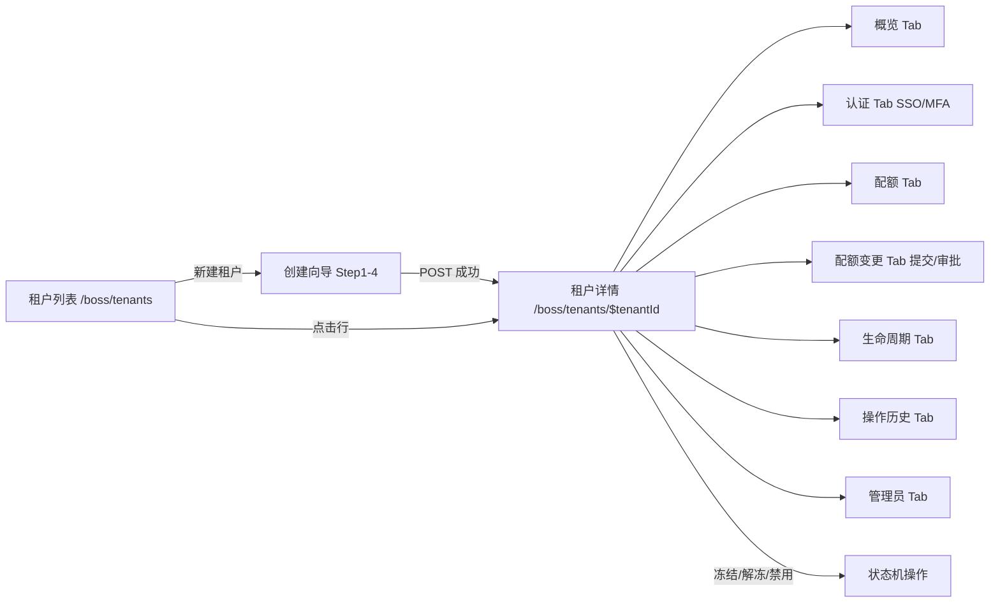

# UX: 租户列表管理

> Interaction specification derived from: [PRD: 租户列表管理](../../prd/boss/tenant/prd-new-boss-tenant-list.md)  
> Plan 参考：[租户管理 plan v3.0](../../plan/tenant/租户管理plan%20v3.0.md) §4.1.1 / §4.1.2 / §4.1.3 / §4.1.6 / §5.2 / §5.2.14  
> 模块主文档：[tenant-list.md](../../../docs/boss-modules/tenant/tenant-list.md)；Services API 相对 `/tenants*`（base `/api/v1/svc`）  
> Generated: 2026-09-02 | **Aligned to backend implementation: 2026-09-04** | Product: BOSS | UI stack: TDesign React + TanStack Router + TanStack Query  
> **后端状态：** API 001–009、011–014 已落地；**SSO 测试连接 = 501 stub**；登录拦截 / MFA 登录强制 / 禁用资源释放 = Deferred；**本 UX 为前端规格，页面实现可另批**

---

## 1. Page Type

### 1.1 Classification

| Screen | Page type | In app shell? | Route |
|--------|----------|---------------|-------|
| 租户列表（模块主页） | list | yes | `/boss/tenants` |
| 创建租户 | wizard（独立路由页） | yes | `/boss/tenants/new` |
| 租户详情（7 Tab） | detail（独立路由页） | yes | `/boss/tenants/$tenantId` |
| 修改基本信息 | dialog (in-detail) | yes | 详情「概览」Tab 内 Dialog |
| 冻结 / 解冻 | inline action + Popconfirm | yes | 列表行操作 + 详情页头 |
| 禁用租户 | dialog (强确认) | yes | 列表行操作 + 详情页头 |
| 修改 SSO / 切换 MFA | inline (in-detail) | yes | 详情「认证」Tab |
| 提交配额变更申请 | dialog (in-detail) | yes | 详情「配额变更」Tab |
| 审批配额变更申请 | inline action + Popconfirm | yes | 详情「配额变更」Tab |

### 1.2 Pattern Reference

复用 BOSS「配额套餐」域的既有模式（`src/components/tenant-plans/` + `src/routes/_authenticated/tenants/quotas*`）：

- 列表页：路由页管 query/mutation，Table 拆独立组件（仿 `PlanTable.tsx`）
- 创建向导：独立路由 + `CreatePlanWizard` 式 Steps 组件（`quotas.new.tsx` 先例）
- 详情页：独立路由 + 多 Tab 平铺（`PlanDetailPage.tsx` / `quotas.$planId.tsx` 先例）
- 写操作 body 带 `idempotency_key`（前端 `crypto.randomUUID()`，对用户不可见；亦可回落 header `Idempotency-Key`），成功后 `invalidateQueries` 刷新
- 状态 Tag 映射拆独立小组件（仿 `planStatus.tsx` → `tenantStatus.tsx`）

---

## 2. Information Architecture

### 2.1 Routes & Entry Points

| Route | Entry (nav / deep link / redirect) | Auth required |
|-------|-------------------------------------|---------------|
| `/boss/tenants` | 侧栏「租户管理 → 租户列表」菜单项 | yes（platform-admin / platform-ops / platform-readonly；readonly 只读） |
| `/boss/tenants/new` | 列表页「新建租户」按钮（仅 admin/ops 可见） | yes（platform-admin / platform-ops） |
| `/boss/tenants/$tenantId` | 列表行「详情」/ 租户名链接 / 创建成功跳转 | yes（同列表） |

### 2.2 Navigation Relationship

```
侧栏菜单
└── 租户管理（SubMenu value="tenant"）
    ├── 租户列表      /boss/tenants            ← 本模块主页
    ├── 配额策略      /boss/tenants/quotas      （已有）
    └── 租户管理员    /boss/tenants/admins      （已有）

/boss/tenants            租户列表
/boss/tenants/new        创建租户向导（完成后跳转详情）
/boss/tenants/$tenantId  租户详情（面包屑：租户管理 / 租户列表 / {display_name}）
```

路由文件结构（TanStack Router file-based，与现有 `tenants/quotas*` 对齐）：

```text
src/routes/_authenticated/tenants/
├── index.tsx            # 租户列表
├── new.tsx              # 创建租户向导
└── $tenantId.tsx        # 租户详情（7 Tab）
```

### 2.3 PRD Coverage Map

| PRD item | Screen / section |
|----------|------------------|
| US-001 查询可用套餐 | §3.1 创建向导 Step2 数据源；§5.2 套餐选择器 |
| US-002 创建租户 | §3.1 创建流程；§4.2 向导；§5.2 |
| US-003 查询租户列表（游标分页） | §3.1 查看流程；§4.1 列表；§5.1 |
| US-004 查询租户详情 | §3.1 详情流程；§4.3 概览 Tab；§5.3 |
| US-005 修改租户基本信息 | §3.2 编辑信息；§4.3；§5.4 |
| US-006 冻结/解冻 | §3.2 冻结解冻；§4.1 / §4.3；§5.5 |
| US-007 禁用租户（含配额前置校验） | §3.2 禁用；§4.4 禁用 Dialog；§5.6 |
| US-008 查看 SSO 配置（含 mfa_required） | §4.3 认证 Tab；§5.7 |
| US-009 修改 SSO 状态与测试连接 | §3.2 SSO 测试连接；§4.3 认证 Tab；§5.7 |
| US-010 切换强制 MFA | §4.3 认证 Tab；§5.7 |
| US-011 查询租户配额 | §4.3 配额 Tab；§5.8 |
| US-012 提交配额变更申请 | §3.2 提交申请；§4.3 配额变更 Tab；§5.9 |
| US-013 查询配额变更申请列表（不分页） | §4.3 配额变更 Tab；§5.9 |
| US-014 审批配额变更申请 | §3.2 审批；§4.3 配额变更 Tab；§5.9 |
| US-015 查询租户生命周期（游标分页） | §4.3 生命周期 Tab；§5.10 |
| US-016 查询租户操作历史（游标分页） | §4.3 操作历史 Tab；§5.10 |
| US-017 查询租户内管理员列表（游标分页） | §4.3 管理员 Tab；§5.11 |

---

## 3. User Flow

### 3.1 Primary Flow

```text
查看租户列表
  用户进入 /boss/tenants
  → 系统加载（GET /svc/tenants?limit=20；翻页携带 cursor）
  → 展示表格：租户（name/display_name）/ 套餐 / 状态 / 管理员数 / 创建时间 / 操作
  → 顶部筛选：status（active/frozen/disabled）Select + 关键字 search Input（debounce 300ms）
  → readonly 角色不渲染「新建租户」与写操作按钮

创建租户（向导）
  用户点击「新建租户」
  → 跳转 /boss/tenants/new，Steps 4 步：
     Step1 基础信息（name/display_name/email）
     Step2 绑定套餐（数据源：可用套餐列表，仅 active）
     Step3 首位管理员（admin_email/admin_name/admin_password + 密码强度提示）
     Step4 确认（摘要只读回显 + 提交）
  → 提交 → POST /svc/tenants（body 含 idempotency_key）
  → 成功：Message.success「租户创建成功」+ 跳转 /boss/tenants/{id}（详情页）
  → 失败：向导停留在当前步，按错误码提示（见 §7.2），保留已填输入

查看租户详情
  用户点击某行「详情」或租户名链接
  → 跳转 /boss/tenants/$tenantId
  → 默认「概览」Tab：基本信息（Descriptions）+ 状态 Tag + user_count/admin_count
  → 页头操作区（随状态机显隐）：冻结 / 解冻 / 禁用 / 编辑信息
  → 其余 Tab 懒加载（切换时才请求）
```

### 3.2 Secondary Flows

```text
修改基本信息
  详情「概览」Tab → 点击「编辑信息」
  → Dialog 表单：display_name / contact_email（name 与 status 只读回显，不可编辑）
  → 提交 → PUT /svc/tenants/{tenantId}（idempotency_key）
  → 成功：关闭 Dialog + Message.success「已保存」+ 刷新概览

冻结 / 解冻
  列表行操作或详情页头 → Popconfirm 二次确认
  → POST /svc/tenants/{tenantId}/freeze | unfreeze（idempotency_key）
  → 成功：Message.success「已冻结/已解冻」+ 刷新（文案勿承诺「立即无法登录」——登录拦截 Deferred）
  → 409 TENANT_STATE_INVALID → Message.error 提示当前状态不允许

禁用租户（强确认）
  列表行操作或详情页头 → 点击「禁用」
  → 弹出禁用 Dialog（非 Popconfirm）
  → 警示：状态不可恢复；**本阶段不删除/不释放资源**；登录拦截后续交付
  → 提交 → POST /svc/tenants/{tenantId}/disable（idempotency_key）
  → 409 TENANT_HAS_RUNNING_RESOURCES：Dialog 内 Alert「gpu/cpu/memory/storage 任一 used+reserved > 0，不可禁用」
  → 成功：Message.success「租户已禁用」+ 刷新（写操作全部消失）

SSO 配置查看 / 修改 / 测试连接
  详情「认证」Tab
  → GET .../auth/sso 展示 sso_enabled / provider / mfa_required / updated_at
  → 切换 SSO / 改 provider → PUT .../auth/sso（idempotency_key）
    · provider 省略/null = 不更新；空串 = 清空
    · disabled 租户 → 409 TENANT_STATE_INVALID
  → 422 TENANT_SSO_CONFIG_INVALID → 「开启 SSO 前需先配置 provider」
  → 「测试连接」：**当前后端 501 NOT_IMPLEMENTED** → 按钮禁用或 Tooltip「暂未开放」；**勿实现成功/discovery 反馈为当前可用行为**
    （远期：POST .../auth/sso/test → { success, discovery_result, error, tested_at }）

切换强制 MFA
  详情「认证」Tab → Switch 切换 mfa_required（body 必须显式带该字段）
  → PUT .../auth/mfa（idempotency_key）
  → 成功：Message.success「MFA 强制开关已更新」+ 刷新（**勿暗示登录侧已强制执行**——Deferred）

提交配额变更申请
  详情「配额变更」Tab → 「提交变更申请」
  → Dialog：items[{resource_type, new_value}]；批内维不重复
  → POST .../quota-requests（idempotency_key；依赖网关 x-request-id / x-user-id）
  → 成功：Message.success「变更申请已提交」
  → 422 QUOTA_CHANGE_REQUEST_INVALID / QUOTA_RESOURCE_NOT_REGISTERED
  → 409 QUOTA_CHANGE_REQUEST_CONFLICT（同请求同维）

审批配额变更申请
  pending 行「通过 / 驳回」→ POST .../quota-requests/{request_id}/approve
  → 409 NOT_PENDING / 404 NOT_FOUND
```

### 3.3 Flow Diagram



---

## 4. Layout Regions

### 4.1 租户列表页

```text
┌─────────────────────────────────────────────────────┐
│ [面包屑：租户管理 / 租户列表]                          │
├─────────────────────────────────────────────────────┤
│ [Toolbar: 新建租户(primary) | status Select | search]│
├─────────────────────────────────────────────────────┤
│ [租户表格 Table]                                     │
│  租户 | 套餐 | 状态 | 管理员数 | 创建时间 | 操作      │
├─────────────────────────────────────────────────────┤
│ [分页 Pagination：上一页/下一页（cursor 驱动）]       │
└─────────────────────────────────────────────────────┘
```

| Screen | Region | Content | Notes |
|--------|--------|---------|-------|
| 列表 | toolbar | 「新建租户」primary Button（admin/ops）+ status Select + search Input | readonly 不渲染新建按钮 |
| 列表 | table | 列：租户（name 等宽 + display_name）/ 套餐（plan_code）/ 状态（Tag）/ 管理员数（admin_count）/ 创建时间 / 操作 | `rowKey="id"` |
| 列表 | row actions | 详情 / 冻结（active 时）/ 解冻（frozen 时）/ 禁用（非 disabled 时） | disabled 行仅「详情」 |
| 列表 | pagination | 上一页/下一页，由 next_cursor 驱动 | limit=20 固定，无页码跳转 |

### 4.2 创建租户向导页

```text
┌─────────────────────────────────────────────────────┐
│ [面包屑：租户管理 / 租户列表 / 新建租户]               │
├─────────────────────────────────────────────────────┤
│ [Steps: 基础信息 → 绑定套餐 → 首位管理员 → 确认]      │
├─────────────────────────────────────────────────────┤
│ [当前步骤表单区]                                     │
├─────────────────────────────────────────────────────┤
│ [Footer: 上一步 | 下一步/提交]                       │
└─────────────────────────────────────────────────────┘
```

| Step | Region | Content | Notes |
|------|--------|---------|-------|
| Step1 基础信息 | form | name（slug 格式提示 + 即时校验）/ display_name / email | name 输入框下方常驻格式说明 |
| Step2 绑定套餐 | form | plan_id 单选（Select 或 RadioCard，展示 name + code） | 数据源：可用套餐列表（仅 active）；空态时提示「暂无可用套餐，请先在配额策略中启用套餐」+ 跳转链接 |
| Step3 首位管理员 | form | admin_email / admin_name / admin_password（Input.Password + 强度说明） | 密码 8-64 字符、至少 3 类；字段下方 helper text |
| Step4 确认 | read-only | 全部入参摘要（Descriptions） | admin_password 显示为「已设置，不回显」 |
| footer | actions | 上一步（Step1 隐藏）/ 下一步 / 提交（Step4，loading） | 步间切换校验当前步 |

### 4.3 租户详情页

```text
┌─────────────────────────────────────────────────────┐
│ [面包屑：租户管理 / 租户列表 / {display_name}]        │
│ [页头：display_name + name + 状态Tag + user/admin数  │
│        操作：编辑信息 | 冻结/解冻 | 禁用]             │
├─────────────────────────────────────────────────────┤
│ [Tabs: 概览 | 管理员 | 配额 | 配额变更 | 认证        │
│        | 生命周期 | 操作历史]                        │
├─────────────────────────────────────────────────────┤
│ [当前 Tab 内容区（懒加载）]                          │
└─────────────────────────────────────────────────────┘
```

| Tab | Content | Data source | Notes |
|-----|---------|-------------|-------|
| 概览 | Descriptions：id/name/display_name/contact_email/email/plan_id/plan_code/status/created_at + frozen_at（frozen 时）/ disabled_at（disabled 时）+ user_count/admin_count；可展示 SSO/MFA 开关摘要（详情 `auth.sso_enabled` / `auth.mfa_required`） | GET /svc/tenants/{tenantId}（含 auth 两布尔） | 「编辑信息」入口 |
| 管理员 | Table：用户 id / 用户名 / 展示名 / 权限（role Tag）/ 状态（+ 邀请中 Tag）/ 来源 / 最近登录 + 游标分页 | GET .../admins | 默认 **tenant-admin ∪ inviting**（默认不含 expired）；proto `TenantScopedAdmin`（形状同 AdminWithTenant）；只读；无 permissions[] |
| 配额 | Table：维度 / 已用 / 总量 / 单位 + Progress | GET .../quota | 只读；单次代理 Core（含 display_name/unit） |
| 配额变更 | Toolbar + Table：`request_id` / 维度 / 原值 / 新值 / 状态 / 申请人 / 时间 / 操作 | GET .../quota-requests | 不分页；同批多行共享 request_id；原值可为 0（线协议占位） |
| 认证 | SSO + MFA；「测试连接」默认禁用（501） | GET .../auth/sso | PUT 带 idempotency_key |
| 生命周期 | action 过滤 Select + Table：action / reason / user_id / request_id / created_at + 游标分页 | GET .../lifecycle | 只读 |
| 操作历史 | action/result 过滤 Select + Table：action / resource / result / user_id / created_at + 游标分页 | GET .../audit-logs | 只读 |

### 4.4 禁用租户 Dialog

```text
┌─────────────────────────────────────────────────────┐
│ Dialog: 禁用租户                                     │
│ ┌─────────────────────────────────────────────────┐ │
│ │ [Alert theme=warning] 禁用后：                  │ │
│ │  · 状态变为「已禁用」，不可恢复（无启用入口）     │ │
│ │  · 本阶段不删除、不释放租户资源                   │ │
│ │  · 登录拦截将在后续版本生效（当前仅状态落库）     │ │
│ └─────────────────────────────────────────────────┘ │
│ 提交后校验 gpu/cpu/memory/storage：任一 used+reserved>0 则拒绝 │
│ [Footer: 取消 | 确认禁用(danger, loading)]          │
└─────────────────────────────────────────────────────┘
```

| Region | Content | Notes |
|--------|---------|-------|
| header | 「禁用租户 - {display_name}」 | Dialog header |
| body-top | Alert：终态 + **不释放资源** + 登录拦截后续 | **禁止**写「资源将被删除」 |
| body-bottom | 四维守卫说明：`used+reserved > 0` 拒绝 | 与后端 Issue-008 一致 |
| footer | 取消 + 确认禁用（danger） | 409 时 Dialog 内 Alert |

---

## 5. Component Mapping

### 5.1 租户列表页

| UI element | TDesign component | Props / variant | Data source |
|------------|-------------------|-----------------|-------------|
| 新建租户按钮 | `Button` | `theme="primary"`, `icon={<AddIcon />}` | — |
| 状态筛选 | `Select` | `clearable`, options: active/frozen/disabled | user select |
| 关键字搜索 | `Input` | `placeholder="搜索名称或显示名"`, `clearable`, prefix `SearchIcon` | user input |
| 租户表格 | `Table` | `rowKey="id"`, `loading`, `bordered` | `GET /svc/tenants` |
| 租户列 | link | name 等宽字体 + display_name 次行 | row.name / row.display_name |
| 套餐列 | `Tag` | 展示 plan_code | row.plan_code |
| 状态列 | `Tag`（`tenantStatus.tsx`） | active→success「活跃」/ frozen→warning「已冻结」/ disabled→default「已禁用」 | row.status |
| 管理员数列 | text | admin_count | row.admin_count（Core 连表返回） |
| 创建时间列 | text | created_at 绝对时间 | row.created_at |
| 行操作-详情 | `Button` | `variant="text"` | — |
| 行操作-冻结 | `Button` + `Popconfirm` | `variant="text"`，仅 active | row.status |
| 行操作-解冻 | `Button` + `Popconfirm` | `variant="text"`，仅 frozen | row.status |
| 行操作-禁用 | `Button` | `variant="text"`, `theme="danger"`，非 disabled；点击打开禁用 Dialog | row.status |
| 分页 | `Pagination` | 上一页/下一页，由 next_cursor 驱动 | API limit/cursor + next_cursor |

### 5.2 创建租户向导

| UI element | TDesign component | Props / variant | Data source |
|------------|-------------------|-----------------|-------------|
| 向导容器 | `Steps` + 表单区 | 4 步：基础信息/绑定套餐/首位管理员/确认 | — |
| name | `FormItem` + `Input` | required；rules 正则 `^[a-z0-9-]{3,40}$`；helper「3-40 位小写字母、数字、连字符，创建后不可修改」 | user input |
| display_name | `FormItem` + `Input` | required | user input |
| email | `FormItem` + `Input` | required，type email | user input |
| plan_id | `FormItem` + `Select`（或 `RadioGroup` 卡片） | required；options: 可用套餐（仅 active，label=name + code） | `GET /svc/tenants/available-plans` |
| admin_email | `FormItem` + `Input` | required，type email | user input |
| admin_name | `FormItem` + `Input` | required | user input |
| admin_password | `FormItem` + `Input.Password` | required；rules: 8-64 字符、至少 3 类（大写/小写/数字/特殊）；helper 常驻 | user input |
| 确认摘要 | `Descriptions` | 全字段只读；admin_password 显示「已设置，不回显」 | 向导 state |
| 上一步 | `Button` | `variant="outline"`（Step1 隐藏） | — |
| 下一步 / 提交 | `Button` | `theme="primary"`；Step4 为「确认创建」，`loading={submitting}` | — |

### 5.3 租户详情页（容器与概览）

| UI element | TDesign component | Props / variant | Data source |
|------------|-------------------|-----------------|-------------|
| 页头 | title + `Tag` | display_name + name + 状态 Tag（同列表映射）+ 「成员 n · 管理员 m」 | GET /svc/tenants/{tenantId} |
| 编辑信息按钮 | `Button` | `variant="outline"`（admin/ops） | — |
| 冻结/解冻按钮 | `Button` + `Popconfirm` | active→「冻结」；frozen→「解冻」；disabled→不渲染 | row.status |
| 禁用按钮 | `Button` | `theme="danger"`, `variant="outline"`，非 disabled；打开禁用 Dialog | row.status |
| Tabs | `Tabs` | 7 个 TabPanel，懒加载 | — |
| 概览 Descriptions | `Descriptions` | 全字段 + frozen_at/disabled_at（按状态） | GET /svc/tenants/{tenantId} |
| 编辑信息 Dialog | `Dialog` + `Form` | display_name / contact_email 可编辑；name/status 只读回显 | user input |

### 5.4 认证 Tab（SSO / MFA）

| UI element | TDesign component | Props / variant | Data source |
|------------|-------------------|-----------------|-------------|
| SSO 区块 | `Descriptions` | sso_enabled / provider / updated_at | `GET .../auth/sso` |
| MFA 区块 | `Descriptions` | mfa_required / 说明文案 | 同上（同接口返回） |
| SSO 开关 | `Switch` | sso_enabled（admin/ops） | user toggle |
| provider | `Input` | 修改 SSO provider | user input |
| SSO 保存 | `Button` | `theme="primary"`, loading；PUT .../auth/sso（idempotency_key） | — |
| 测试连接 | `Button` | `variant="outline"`；**默认 disabled** + Tooltip「暂未开放」（后端 501） | Issue-010 |
| 测试结果 | — | 端点开放后再接 success/discovery/error | 延期 |
| MFA 开关 | `Switch` | mfa_required 必填布尔；PUT .../auth/mfa；文案仅「开关已更新」 | 登录强制 Deferred |

### 5.5 配额 / 配额变更 / 历史 Tab

| UI element | TDesign component | Props / variant | Data source |
|------------|-------------------|-----------------|-------------|
| 配额表格 | `Table` | 维度（display_name+resource_type）/ used/total（+`Progress`）/ unit；无分页 | `GET .../quota` |
| 申请状态过滤 | `Select` | clearable, options: pending/approved/rejected | user select |
| 提交变更申请按钮 | `Button` | `theme="primary"`（admin/ops） | — |
| 申请表格 | `Table` | 维度 / 原值 / 新值 / 状态（`Tag`: pending→warning / approved→success / rejected→default）/ 申请人 / 申请时间 / 操作；无分页 | `GET .../quota-requests` |
| 提交申请 Dialog | `Dialog` + `Form` | 动态行 items[{resource_type, new_value}]；至少 1 行；同维度不可重复 | user input |
| 行操作-通过 | `Button` + `Popconfirm` | `variant="text"`，仅 pending（admin/ops） | row.status |
| 行操作-驳回 | `Button` + `Popconfirm` | `variant="text"`, `theme="danger"`，仅 pending | row.status |
| 生命周期/历史过滤 | `Select` | lifecycle: action；audit-logs: action + result | user select |
| 生命周期表格 | `Table` | action/reason/user_id/request_id/created_at | `GET .../lifecycle` |
| 操作历史表格 | `Table` | action/resource/result(`Tag`)/user_id/created_at | `GET .../audit-logs` |
| Tab 内分页 | `Pagination` | 上一页/下一页（lifecycle 与 audit-logs），next_cursor 驱动 | API limit/cursor |

### 5.6 管理员 Tab

| UI element | TDesign component | Props / variant | Data source |
|------------|-------------------|-----------------|-------------|
| 管理员表格 | `Table` | 同上；游标分页 | `GET .../admins` → `TenantScopedAdmin` |
| 前往管理入口 | `Button` | `variant="text"`「前往租户管理员管理」跳 `/boss/tenants/admins`（携带租户上下文） | — |

---

## 6. State Design

### 6.1 租户列表页

| State | Trigger | UI behavior | Components |
|-------|---------|-------------|------------|
| idle | 初始加载成功 | 正常展示表格 | Table |
| loading | `useQuery` isLoading | 表格 `loading=true` | Table loading |
| empty | items 长度 0 且非 loading/error | `Empty` + 「暂无租户」+ `Button`「新建租户」（admin/ops） | Empty |
| error | API 失败 | `Alert theme="error"` + request_id + `Button`「重试」 | Alert |
| filter | 切换 status Select | 立即重新查询（cursor 重置） | Select |
| search | 输入关键字 | debounce 300ms 后重新查询 | Input |
| page-change | 翻页 | 携带 cursor 重新查询；首页后禁用「上一页」 | Pagination |
| no-permission | 403 | 页面级 `Alert`「无访问权限」，不渲染表格数据 | Alert |

### 6.2 创建租户向导

| State | Trigger | UI behavior | Components |
|-------|---------|-------------|------------|
| step-validating | 步间切换 | 校验当前步表单，错误内联展示；失败则阻止进入下一步 | Form |
| plan-loading | Step2 进入 | 套餐 Select loading | Select loading |
| plan-empty | 可用套餐为空 | `Empty`「暂无可用套餐」+ 跳转配额策略链接；「下一步」禁用 | Empty |
| submitting | POST /svc/tenants 进行中 | 「确认创建」按钮 loading，Steps 禁用切换 | Button loading |
| success | 200 | `Message.success`「租户创建成功」+ 跳转 /boss/tenants/{id} | Message |
| error-409 | TENANT_NAME_CONFLICT | `Message.error`「租户标识已被占用」，停留在 Step1 相关字段旁内联提示 | Message |
| error-422 | PLAN_NOT_ACTIVE | `Message.error`「所选套餐不可用，请重新选择」，回到 Step2 | Message |
| error-4xx/5xx | 其他失败 | `Message.error` 展示 API message + request_id；保留全部输入 | Message |

### 6.3 租户详情页（容器与概览）

| State | Trigger | UI behavior | Components |
|-------|---------|-------------|------------|
| loading | 进入详情页 | 页头 Skeleton + Tab 区 Skeleton | Skeleton |
| error-404 | TENANT_NOT_FOUND | `Empty`「租户不存在」+ 返回列表链接 | Empty |
| error | 其他加载失败 | `Alert theme="error"` + 重试 | Alert |
| tab-lazy-loading | 切换 Tab 首次加载 | Tab 内容区 loading | Table loading |
| tab-empty | 当前 Tab 无数据 | 各 Tab `Empty`（管理员「暂无管理员」/ 配额「暂无配额数据」等） | Empty |
| edit-open | 点击「编辑信息」 | Dialog 打开，回显当前值 | Dialog + Form |
| edit-submitting | PUT 进行中 | 确认按钮 loading | Button loading |
| edit-success | 200 | 关闭 Dialog + `Message.success`「已保存」+ 刷新概览 | Message |

### 6.4 冻结 / 解冻

| State | Trigger | UI behavior | Components |
|-------|---------|-------------|------------|
| confirming | Popconfirm 展示 | 冻结：「确认冻结？状态变为已冻结，资源保持原状（登录拦截后续交付）」；解冻：「确认解冻？」 | Popconfirm |
| submitting | POST freeze/unfreeze 进行中 | 按钮 loading，Popconfirm 关闭 | — |
| success | 200 | `Message.success`「已冻结/已解冻」+ 刷新 | Message |
| error-409 | TENANT_STATE_INVALID | `Message.error`「当前状态不允许该操作」+ 刷新（同步最新状态） | Message |

### 6.5 禁用租户

| State | Trigger | UI behavior | Components |
|-------|---------|-------------|------------|
| dialog-open | 点击「禁用」 | Dialog 打开，Alert warning 两条不可逆后果常驻 | Dialog |
| submitting | POST disable 进行中 | 「确认禁用」loading | Button loading |
| error-409 | TENANT_HAS_RUNNING_RESOURCES | Dialog 内 `Alert theme="error"`「该租户计算/存储配额仍有占用（gpu/cpu/memory/storage），请先清理后再禁用」；Dialog 保持打开 | Alert |
| error-409 | TENANT_STATE_INVALID | Dialog 内 Alert error 提示状态非法 + 刷新 | Alert |
| success | 200 | 关闭 Dialog + `Message.success`「租户已禁用」+ 刷新（状态灰 Tag；编辑/冻结等写操作全部消失，仅剩详情与审计类 Tab） | Message |

### 6.6 认证 Tab（SSO / MFA）

| State | Trigger | UI behavior | Components |
|-------|---------|-------------|------------|
| loading | Tab 首次加载 | Descriptions Skeleton | Skeleton |
| sso-toggle-invalid | 开启 SSO 但无 provider | Switch 旁内联错误「请先填写 provider」（422 TENANT_SSO_CONFIG_INVALID 同文案） | inline |
| sso-saving | PUT .../auth/sso 进行中 | 保存按钮 loading | Button loading |
| sso-success | 200 | `Message.success`「SSO 配置已保存」+ 刷新 | Message |
| test-unavailable | 当前后端 | 按钮 disabled / Tooltip「暂未开放」（501） | Button disabled |
| test-* | Issue-010 完成后 | 再启用 loading / success / fail | Deferred |
| mfa-toggling | PUT .../auth/mfa 进行中 | Switch loading | Switch loading |
| mfa-success | 200 | `Message.success`「MFA 强制开关已更新」+ 刷新 | Message |
| auth-409 | disabled 租户改 Auth | `Message.error`「当前状态不允许该操作」 | Message |

### 6.7 配额 / 配额变更 Tab

| State | Trigger | UI behavior | Components |
|-------|---------|-------------|------------|
| quota-loading | 配额 Tab 首次加载 | Table loading | Table loading |
| quota-empty | items 为空 | `Empty`「暂无配额数据」 | Empty |
| request-open | 点击「提交变更申请」 | Dialog 打开，初始 1 行 | Dialog |
| request-invalid | 行校验失败 | 格式/重复/为负 → QUOTA_CHANGE_REQUEST_INVALID；未注册维 → QUOTA_RESOURCE_NOT_REGISTERED；同请求同维 → CONFLICT | Form |
| request-submitting | POST 进行中 | 提交按钮 loading | Button loading |
| request-success | 200 | 关闭 Dialog + `Message.success`「变更申请已提交」+ 刷新 | Message |
| approve-confirming | Popconfirm 展示 | 通过文案「确认将该维度配额更新为新值？」；驳回文案「确认驳回该申请？驳回不修改配额」 | Popconfirm |
| approve-submitting | POST approve 进行中 | 行按钮 loading | — |
| approve-success | 200 | `Message.success`「已通过/已驳回」+ 刷新（状态 Tag 变更，操作按钮消失） | Message |
| approve-409 | QUOTA_CHANGE_REQUEST_NOT_PENDING | `Message.error`「该申请已被处理」+ 刷新 | Message |
| approve-404 | QUOTA_CHANGE_REQUEST_NOT_FOUND | `Message.error`「申请不存在」+ 刷新 | Message |

### 6.8 生命周期 / 操作历史 / 管理员 Tab

| State | Trigger | UI behavior | Components |
|-------|---------|-------------|------------|
| loading | Tab 首次加载 / 翻页 | Table loading | Table loading |
| empty | items 为空 | 各自 `Empty`（「暂无状态变更记录」/「暂无操作记录」/「暂无管理员」） | Empty |
| filter | 切换 action/result 过滤 | cursor 重置重新查询 | Select |
| page-change | 翻页 | 携带 cursor 重新查询 | Pagination |

---

## 7. Copy & Feedback

### 7.1 Labels & Buttons

| Element | Copy (zh-CN) | Notes |
|---------|--------------|-------|
| 页面标题 | 租户列表 | 侧栏菜单同名 |
| 主 CTA | 新建租户 | 列表 toolbar |
| 向导步骤 | 基础信息 / 绑定套餐 / 首位管理员 / 确认 | Steps |
| 详情 Tab | 概览 / 管理员 / 配额 / 配额变更 / 认证 / 生命周期 / 操作历史 | Tabs |
| 状态操作 | 冻结 / 解冻 / 禁用 / 编辑信息 | 详情页头 + 行操作 |
| 认证操作 | 测试连接 / 保存 SSO 配置 | 认证 Tab |
| 配额变更操作 | 提交变更申请 / 通过 / 驳回 | 配额变更 Tab |

### 7.2 Messages

| Scenario | Type | Copy |
|----------|------|------|
| 创建成功 | `Message.success` | 租户创建成功 |
| name 冲突（409 TENANT_NAME_CONFLICT） | `Message.error` | 租户标识已被占用 |
| 套餐不可用（422 PLAN_NOT_ACTIVE） | `Message.error` | 所选套餐不可用，请重新选择 |
| 编辑保存成功 | `Message.success` | 已保存 |
| 冻结成功 | `Message.success` | 已冻结 |
| 解冻成功 | `Message.success` | 已解冻 |
| 禁用成功 | `Message.success` | 租户已禁用（不可恢复；本阶段不释放资源） |
| 禁用被拒（409 TENANT_HAS_RUNNING_RESOURCES） | `Alert error`（Dialog 内） | 计算/存储配额仍有占用（gpu/cpu/memory/storage 的 used+reserved），请先清理后再禁用 |
| 状态非法（409 TENANT_STATE_INVALID） | `Message.error` | 当前状态不允许该操作 |
| SSO 配置非法（422 TENANT_SSO_CONFIG_INVALID） | inline | 请先填写 provider 再开启 SSO |
| 测试连接不可用 | Tooltip / disabled | 暂未开放 |
| MFA 切换成功 | `Message.success` | MFA 强制开关已更新 |
| 申请提交成功 | `Message.success` | 变更申请已提交 |
| 申请校验失败（422） | inline | QUOTA_CHANGE_REQUEST_INVALID / QUOTA_RESOURCE_NOT_REGISTERED |
| 申请冲突（409 CONFLICT） | `Message.error` | 同一申请内不可重复同一维度 |
| 审批成功 | `Message.success` | 已通过 / 已驳回 |
| 申请非 pending（409 QUOTA_CHANGE_REQUEST_NOT_PENDING） | `Message.error` | 该申请已被处理 |
| 网络错误 | `Message.error` | 网络异常，请重试（request_id） |

---

## 8. Boundaries & Non-Goals

### 8.1 In Scope (UX)

- 租户列表（筛选/搜索/游标分页）与状态操作入口
- 创建租户向导（4 步，含套餐选择与首位管理员）
- 租户详情 7 Tab
- SSO/MFA **配置**查看与修改（测试连接标「暂未开放」直至 Issue-010）
- 配额变更提交与审批（跨请求同维多 pending）
- 禁用强确认 + used+reserved 四维拦截反馈

### 8.2 Explicitly Out of Scope / Deferred（交互层）

- Console 自助；套餐 CRUD；绑定套餐更新配额；管理员权限矩阵/重置密码（跳转既有模块）
- 计费用量；EnableTenant；密码明文回显；页码分页
- **SSO 测试连接成功路径**（后端 501）
- **登录拦截「无法登录」作为已生效系统行为**（产品意图可保留文案，须标明后续）
- **MFA 登录强制执行**（仅配置开关）
- **禁用时删除/释放资源**（与后端相反，禁止写入）

### 8.3 Open UX Questions

- Q1：创建向导 Step2 套餐选择用 Select 下拉还是 RadioCard 卡片（展示套餐配额摘要更直观）？当前按 Select + name/code 映射，若套餐数量少（<5）可升级卡片。
- Q2：列表「管理员数」列 admin_count 是否需要点击跳转详情「管理员」Tab？（当前仅静态数字，未做成链接）

### 8.4 Assumptions

- 使用既有 `_authenticated` 布局与「租户管理」SubMenu（已由租户管理员 UX 规划：租户列表/配额策略/租户管理员三项）
- 写操作由前端生成 body `idempotency_key`（可回落 header）；对用户不可见
- platform-readonly 隐藏写入口；admin/ops 权限一致
- 状态色：active→success、frozen→warning、disabled→default
- Tab 懒加载；配额与配额变更列表不分页
- lifecycle action 过滤值为 create/freeze/unfreeze/disable（**不是** active/frozen/disabled）
- 本 UX 不暗示 `frontends/boss` 页面已落地；实现以另批为准
