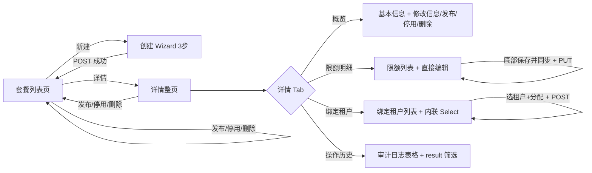

# UX: 配额套餐管理

> Interaction specification derived from: [PRD: 配额套餐管理](../../prd/boss/tenant/prd-new-boss-tenant-quota-policy.md)
> Plan 参考：[租户管理 plan v3.0](../../plan/tenant/租户管理plan%20v3.0.md) §4.2 / §5.3 / §7.3.3c
> Part of ani-workflow artifact triad — next: `/prd-to-spec`
> Generated: 2026-08-04 | Updated: 2026-08-14（对齐实现代码：独立路由 `/new`/`/$planId`、点击搜索 + Radio 筛选、文案） | Product: BOSS | UI stack: TDesign React + TanStack Router + TanStack Query

---

## 1. Page Type

### 1.1 Classification

| Screen | Page type | In app shell? | Route |
|--------|----------|---------------|-------|
| 套餐列表 | list | yes | `/tenants/quotas`（壳内路径；侧栏展示为租户管理 → 配额策略） |
| 创建套餐 | wizard (standalone page) | yes | `/tenants/quotas/new`（独立创建页 3 步 Wizard，非 Dialog、非列表页内嵌） |
| 套餐详情 | page (standalone) | yes | `/tenants/quotas/$planId`（独立整页，非 Drawer 浮层） |
| 查询+修改限额 | page (tab within detail) | yes | `/tenants/quotas/$planId`（详情页「限额明细」Tab，行内编辑） |
| 绑定套餐+查询绑定租户 | page (tab within detail) | yes | `/tenants/quotas/$planId`（详情页「绑定租户」Tab，内联 Select 选租户绑定） |
| 操作历史 | page (tab within detail) | yes | `/tenants/quotas/$planId`（详情页「操作历史」Tab） |

### 1.2 Pattern Reference

复用 BOSS 现有「收件邮箱」页的 **列表 + 增删改** 模式，但详情改为独立整页（非 Drawer）：
- 路由页管 query/mutation
- Table 与详情页拆成独立组件
- 写操作 body 带 `idempotency_key`，成功后 `invalidateQueries` 刷新

---

## 2. Information Architecture

### 2.1 Routes & Entry Points

| Route | Entry (nav / deep link / redirect) | Auth required |
|-------|-------------------------------------|---------------|
| `/tenants/quotas` | 侧栏「租户管理 → 配额策略」菜单项 | yes（platform-admin / platform-ops / platform-readonly） |
| `/tenants/quotas/new` | 列表页「新建套餐」 | yes（写角色） |
| `/tenants/quotas/$planId` | 列表行「详情」 | yes |

### 2.2 Navigation Relationship

```
侧栏菜单
└── 租户管理（SubMenu）
    ├── 租户列表      /tenants
    ├── 配额策略      /tenants/quotas    ← 本模块列表入口
    └── 租户管理员    /tenants/admins
```

需在 `_authenticated.tsx` 的 `Menu.SubMenu value="tenant"` 下新增 `Menu.MenuItem value="tenant-quotas"` 指向 `/tenants/quotas`（已实现）。

> 注：租户计费与用量（`/boss/tenants/billing`）暂不实现，不计入本期菜单。

### 2.3 PRD Coverage Map

| PRD item | Screen / section |
|----------|------------------|
| US-001 创建套餐 | §3.1 主流程-创建；§4 套餐列表-创建 Wizard；§5 创建表单 |
| US-002 查询套餐列表 | §3.1 主流程-查看；§4 套餐列表-表格；§5 列表组件 |
| US-003 查询套餐详情 | §3.1 主流程-查看详情；§4 详情页 |
| US-004 查询套餐限额 | §3.1 主流程-查看详情；§4 详情页-限额 Tab |
| US-005 发布套餐 | §3.2 二级流程-发布；§4 列表行操作 + 详情操作 |
| US-006 禁用套餐 | §3.2 二级流程-禁用；§4 列表行操作 + 详情操作 |
| US-007 删除套餐 | §3.2 二级流程-删除；§4 列表行操作 + 详情操作 |
| US-008 修改套餐限额 | §3.2 二级流程-修改限额；§4 详情页-限额 Tab（行内编辑） |
| US-009 绑定套餐更新配额 | §3.2 二级流程-绑定套餐；§4 详情页-绑定租户 Tab（内联绑定） |
| US-010 查询套餐绑定租户 | §3.2 二级流程-查看绑定租户；§4 详情页-绑定租户 Tab |
| US-011 套餐操作历史 | §3.2 二级流程-查看历史；§4 详情页-操作历史 Tab |
| US-016 更新套餐基本信息 | §3.2 二级流程-修改基本信息；§4 详情页-修改信息弹窗 |
| US-017 查询配额元数据 | §3.1 主流程-创建（Wizard step2 拉取维度）；§4 详情页-限额 Tab（展示维度） |
| US-018 可绑定租户列表 | §3.2 二级流程-绑定套餐；§4 详情页-绑定租户 Tab（Select 选项来源） |

---

## 3. User Flow

### 3.1 Primary Flow

```text
查看套餐列表
  用户进入 /tenants/quotas
  → 系统加载套餐列表（GET /tenant-plans?limit=20；翻页携带 cursor）
  → 工具栏：Input「按名称搜索」+ 点击「搜索」/「重置」；Radio.Group 状态（全部/启用/停用/草稿）
  → 展示表格：套餐 / 编码 / 状态 / 绑定租户 / 更新时间 / 操作

查看套餐详情
  用户点击某行「详情」
  → 路由跳转到 /tenants/quotas/$planId（GET /tenant-plans/{planId}）
  → 展示套餐信息概览 + 4 个 Tab（概览/限额明细/绑定租户/操作历史）

创建套餐
  用户点击「新建套餐」
  → 路由跳转到 /tenants/quotas/new（独立页 3 步 Wizard：名称编码 → 限额配置 → 确认发布）
  → 步骤2 拉取配额元数据（GET /quota-meta），展示全部启用维度行
  → 每个维度 InputNumber 填 total，留空 = 用默认值（传 null，后端物化 default_quota）
  → 步骤3 标题「确认发布」，主按钮「确认创建」；提交后为草稿，需再「发布」才可分配
  → 点击「确认创建」
  → 系统提交（POST /tenant-plans，body 含 idempotency_key，全维度提交，未填传 null）
  → 成功：Message.success「套餐已创建」+ 返回列表并刷新
  → 失败：Message.error 显示错误码对应文案
```

### 3.2 Secondary Flows

```text
发布套餐（draft/disabled → active）
  用户在列表行操作或详情页中点击「发布」
  → 弹出 Popconfirm「确认发布该套餐？发布后可被新租户引用。」
  → 确认 → POST /tenant-plans/{planId}/activate
  → 成功：Message.success「套餐已发布」+ 刷新

停用套餐（active → disabled）
  用户在列表行操作或详情页中点击「停用」
  → 弹出 Popconfirm「停用后不可被新租户引用，已绑定租户不受影响。确认停用？」
  → 确认 → POST /tenant-plans/{planId}/disable
  → 成功：Message.success「套餐已停用」+ 刷新

删除套餐（任意状态，校验无租户关联）
  用户点击「删除」
  → 弹出 Popconfirm（danger 主题）「删除后套餐编码可被新套餐复用。此操作不可撤销，确认删除？」
  → 确认 → DELETE /tenant-plans/{planId}
  → 成功：Message.success「套餐已删除」+ 返回列表页
  → 409 TENANT_PLAN_IN_USE：Message.error「该套餐已关联租户，不可删除」

修改套餐基本信息（name / description）
  用户在详情页点击「修改信息」
  → 弹出 EditPlanInfoDialog 弹窗
  → 修改 name 和/或 description
  → 点击「保存」
  → 系统提交（PUT /tenant-plans/{planId}，body 含 idempotency_key）
  → 成功：Message.success「套餐信息已更新」+ 刷新详情
  → 失败：Message.error 显示错误文案

修改套餐限额（直接编辑 + 批量提交）
  用户在详情页「限额明细」Tab 中
  → 每行限额的 total 列直接为可编辑 InputNumber，预填后端兜底后的具体 total（NULL 已由 default_quota 赋值）
  → 用户直接修改所需维度的 total 值
  → 点击底部「保存并同步绑定租户」按钮
  → 系统提交（PUT /tenant-plans/{planId}/quota-limits，body 含 idempotency_key，提交全部维度）
  → 成功：Message.success「限额已修改，已同步 N 个存量租户」+ 刷新限额列表
  → 失败：Message.error 显示错误文案，保持已填值

查看绑定租户
  用户在详情页中切换到「绑定租户」Tab
  → 系统加载（GET /tenant-plans/{planId}/tenants）
  → 展示绑定该套餐的租户列表：租户标识 / 显示名 / 状态

绑定套餐更新配额（在绑定租户 Tab 内联操作）
  用户在详情页「绑定租户」Tab 中
  → 页面内 Select 下拉（filterable，加载 GET /tenant-plans/{planId}/bindable-tenants 可绑定租户列表）
  → 选择租户 + 点击「分配」按钮
  → 系统提交（POST /tenants/{tenantId}/plan，入参 idempotency_key + plan_id）
  → 成功：Message.success「套餐已绑定，配额已更新」+ 刷新绑定租户列表
  → 失败-404：Message.error「套餐不存在或未发布」
  → 失败-409 TENANT_STATE_INVALID：Message.error「租户已停用，不可绑定套餐」

查看操作历史
  用户在详情页中切换到「操作历史」Tab
  → 系统加载（GET /tenant-plans/{planId}/audit-logs?limit=20；翻页携带 cursor）
  → 展示操作历史表格：操作 / 结果 / 详情 / 时间
  → 一个 Select 本地筛选 result（成功/失败）
```

### 3.3 Flow Diagram



---

## 4. Layout Regions

### 4.1 套餐列表页

```text
┌──────────────────────────────────────────────────────────────┐
│ [Page Header: 标题「配额策略」 + 副标题 + 新建按钮]            │
├──────────────────────────────────────────────────────────────┤
│ [Toolbar: 搜索框 | 状态筛选下拉]                              │
├──────────────────────────────────────────────────────────────┤
│ [Table: 套餐 | 编码 | 状态 | 绑定租户 | 更新时间 | 操作]       │
│  ┌─ 行操作：详情 | 发布/停用 | 删除                           │
│  └─ 状态列：Tag 徽标（draft=灰 / active=绿 / disabled=红）    │
├──────────────────────────────────────────────────────────────┤
│ [分页：上一页 | 下一页，由 next_cursor 驱动]                   │
└──────────────────────────────────────────────────────────────┘
```

| Screen | Region | Content | Notes |
|--------|--------|---------|-------|
| 套餐列表 | page header | 标题「配额策略」+ 副标题「定义套餐并绑定到租户，限额变更自动同步」+ 主操作「新建套餐」按钮 | platform-admin/ops 可见新建按钮；readonly 隐藏 |
| 套餐列表 | toolbar | `Input` 搜索框（搜 name，placeholder「按名称搜索」）+「搜索」/「重置」按钮 + `Radio.Group` 状态（全部/启用/停用/草稿） | 点击搜索或 Enter 才提交关键字；非 debounce |
| 套餐列表 | table | 列：套餐(name) / 编码(code) / 状态(Tag) / 绑定租户(tenant_count) / 更新时间(updated_at) / 操作 | 列来源对齐 API `GET /tenant-plans` 响应字段 |
| 套餐列表 | pagination | `Pagination`（上一页/下一页），由 API `next_cursor` 驱动；每页 `limit` 默认 20，可选 10/20/50/100 | 请求参数 `limit` + `cursor` |

### 4.2 创建套餐 Wizard（3 步向导）

```text
┌─────────────────────────────────────────────────────┐
│ [Steps: 名称与编码 → 限额配置 → 确认发布]            │
├─────────────────────────────────────────────────────┤
│ 步骤 1: 名称与编码                                    │
│  套餐名称 (name)    [Input]  *必填                    │
│  套餐编码 (code)    [Input]  *必填                    │
│  说明 (description) [Textarea]  可选                  │
│  [上一步(隐藏) / 下一步]                              │
├─────────────────────────────────────────────────────┤
│ 步骤 2: 限额配置                                      │
│  [Table: 维度 | 展示名 | 限额(InputNumber) | 单位]    │
│  拉取 GET /quota-meta 全部启用维度                    │
│  InputNumber 留空 = 用默认值                          │
│  [上一步 / 下一步]                                    │
├─────────────────────────────────────────────────────┤
│ 步骤 3: 确认发布                                      │
│  概览：name / code / description                      │
│  限额维度列表：每个维度展示 total 或「默认 N」         │
│  [上一步 / 确认创建]                                  │
└─────────────────────────────────────────────────────┘
```

| Screen | Region | Content | Notes |
|--------|--------|---------|-------|
| 创建 Wizard | step 1 | `Form layout="vertical"`：name(`Input`, required, max 64) + code(`Input`, required, pattern `^[a-z0-9-]{3,40}$`) + description(`Textarea`, max 512) | — |
| 创建 Wizard | step 2 | `Table` 展示全部启用维度（来自 `GET /quota-meta`）：resource_type / display_name / total(`InputNumber` min=0) / unit | InputNumber 留空传 null，后端用 default_quota |
| 创建 Wizard | step 3 | 确认概览：name / code / description + 限额维度列表（每个维度展示 total 或「默认 {default_quota}」） | 未填维度以 total=null 提交，后端按 default_quota 落库。提交后状态为草稿，需「发布」后才可分配 |
| 创建 Wizard | footer | 步骤1：取消 / 下一步；步骤2：上一步 / 下一步；步骤3：上一步 / 确认创建 | — |

### 4.3 套餐详情页（独立整页）

```text
┌──────────────────────────────────────────────────────────────────┐
│ [标题: 套餐详情 - {name}（{code}）]                                │
│ [副标题: 概览 · 限额明细 · 绑定租户 · 操作历史]                     │
│ [操作按钮区(platform-admin/ops): 修改信息 | 发布/停用 | 删除]      │
├──────────────────────────────────────────────────────────────────┤
│ [Tabs: 概览 | 限额明细 | 绑定租户 | 操作历史]                      │
│                                                                     │
│ ── Tab 1: 概览 ──                                                  │
│  编码: pro          状态: [Tag: active]                             │
│  套餐: 专业版        绑定租户: 12                                     │
│  说明: 适用于中小团队                                               │
│  创建时间: 2026-07-20 10:00    更新时间: 2026-07-21 15:00           │
│                                                                     │
│ ── Tab 2: 限额明细（查询 + 直接编辑）──                             │
│  [Alert info: 修改后自动同步存量租户...]                            │
│  [Table: 维度 | 展示名 | 限额(InputNumber) | 单位]                 │
│  [底部: 保存并同步绑定租户 按钮（platform-admin/ops 可见）]         │
│                                                                     │
│ ── Tab 3: 绑定租户（查询 + 内联绑定）──                             │
│  [Select(filterable) + 分配 按钮（platform-admin/ops 可见）]       │
│  [Table: 租户标识 | 显示名 | 状态(Tag)]                             │
│  不分页，展示完整列表；空态：「未绑定租户」                          │
│                                                                     │
│ ── Tab 4: 操作历史 ──                                              │
│  [筛选: result 下拉（成功/失败）]                                   │
│  [Table: 操作 | 结果(Tag) | 详情 | 时间]                            │
│  [分页：上一页 | 下一页，由 next_cursor 驱动]                        │
└──────────────────────────────────────────────────────────────────┘
```

| Screen | Region | Content | Notes |
|--------|--------|---------|-------|
| 详情页 | header | 标题「套餐详情 - {name}（{code}）」+ 副标题 + 操作按钮区 | — |
| 详情页 | 操作区 | 根据 status 显示：修改信息(弹窗) + draft/disabled → 「发布」按钮；active → 「停用」按钮；任意状态 → 「删除」按钮(danger) | platform-admin/ops 可见；readonly 隐藏 |
| 详情页 | Tabs | `Tabs` 四个 Tab：概览(默认选中) / 限额明细 / 绑定租户 / 操作历史 | — |
| 详情页 | 概览 Tab | 只读展示 code / name / description / status(Tag) / tenant_count / created_at / updated_at | 字段来自 `GET /tenant-plans/{planId}` |
| 详情页 | 限额明细 Tab-表格 | `Table` 展示维度 / 展示名 / 限额 / 单位；total 列为 `InputNumber`（后端已用 default_quota 兜底赋值，预填具体数值） | 数据来自 `GET /tenant-plans/{planId}/quota-limits` |
| 详情页 | 限额明细 Tab-底部操作 | 底部「保存并同步绑定租户」按钮（platform-admin/ops 可见），点击后 PUT 提交全部维度 | — |
| 详情页 | 限额明细 Tab-提示 | `Alert theme="info"` 常驻提示「修改后自动同步已绑定该套餐的存量租户。已审批通过的配额变更申请维度将保留不覆盖。」 | — |
| 详情页 | 绑定租户 Tab-工具栏 | `Select`(filterable, 加载可绑定租户列表) + 「分配」按钮（platform-admin/ops 可见），仅 active 套餐可分配 | 数据来自 `GET /tenant-plans/{planId}/bindable-tenants` |
| 详情页 | 绑定租户 Tab-列表 | `Table` 展示租户标识 / 显示名 / 状态(Tag)；不分页；空态 `Empty`「未绑定租户」 | 数据来自 `GET /tenant-plans/{planId}/tenants` |
| 详情页 | 操作历史 Tab | `Select` result 筛选（成功/失败，本地过滤）+ `Table`（操作 / 结果(Tag) / 详情 / 时间）+ `Pagination`（由 `next_cursor` 驱动） | 数据来自 `GET /tenant-plans/{planId}/audit-logs` |

---

## 5. Component Mapping

### 5.1 套餐列表

| UI element | TDesign component | Props / variant | Data source |
|------------|-------------------|-----------------|-------------|
| 新建套餐按钮 | `Button` | `theme="primary"`, `icon={<AddIcon />}` | — |
| 搜索框 | `Input` | `placeholder="按名称搜索"`, `clearable`, prefix-icon `SearchIcon`；配合「搜索」「重置」按钮 | user input |
| 状态筛选 | `Select` | `clearable`, options: draft/active/disabled | user select |
| 套餐表格 | `Table` | columns 见下, `rowKey="id"`, `loading`, `bordered` | API `GET /tenant-plans` |
| 状态列 | `Tag` | draft → `theme="default" variant="light"`；active → `theme="success" variant="light"`；disabled → `theme="danger" variant="light"` | row.status |
| 操作-详情 | `Button` | `variant="text"` | — |
| 操作-发布 | `Button` + `Popconfirm` | `variant="text"`，仅 draft/disabled 显示 | row.status |
| 操作-停用 | `Button` + `Popconfirm` | `variant="text"`，仅 active 显示 | row.status |
| 操作-删除 | `Button` + `Popconfirm` | `theme="danger"`, `variant="text"` + Popconfirm danger 主题 | — |
| 分页 | `Pagination` | 上一页/下一页，由 `next_cursor` 驱动；每页 `limit` 默认 20 | API limit/cursor + next_cursor |

### 5.2 创建套餐 Wizard

| UI element | TDesign component | Props / variant | Data source |
|------------|-------------------|-----------------|-------------|
| Wizard 容器 | `Steps` | current={step}, options: [名称与编码, 限额配置, 确认发布] | — |
| 步骤1 表单 | `Form` | `layout="vertical"`, `form`, `resetType="empty"` | — |
| 套餐名称 | `FormItem` + `Input` | `name="name"`, rules: required, max 64 | user input |
| 套餐编码 | `FormItem` + `Input` | `name="code"`, rules: required + pattern `^[a-z0-9-]{3,40}$` | user input |
| 说明 | `FormItem` + `Textarea` | `name="description"`, maxlength 512, autosize | user input |
| 步骤2 限额表格 | `Table` | columns: resource_type / display_name / total(InputNumber) / unit, `rowKey="resource_type"` | `GET /quota-meta` |
| 限额 InputNumber | `InputNumber` | `min=0`, placeholder={default_quota}, 留空传 null | user input |
| 步骤3 确认概览 | div | 展示 name/code/description + 限额维度列表 | draft + totals |
| 取消/上一步 | `Button` | `variant="outline"` | — |
| 下一步/确认创建 | `Button` | `theme="primary"`, `loading={submitting}` | — |

### 5.3 详情页

| UI element | TDesign component | Props / variant | Data source |
|------------|-------------------|-----------------|-------------|
| 状态 Tag | `Tag` | 同列表状态映射 | plan.status |
| 修改信息按钮 | `Button` | `variant="outline"`, 文本「修改信息」 | — |
| 修改信息弹窗 | `Dialog` | `visible`, `header="修改套餐信息"`, `width=520`, `destroyOnClose` | — |
| 弹窗-名称 | `FormItem` + `Input` | `name="name"`, required, max 64 | plan.name |
| 弹窗-说明 | `FormItem` + `Textarea` | `name="description"`, maxlength 512 | plan.description |
| 发布按钮 | `Button` + `Popconfirm` | `theme="primary"`, 仅 draft/disabled 显示 | plan.status |
| 停用按钮 | `Button` + `Popconfirm` | `variant="outline"`, 仅 active 显示 | plan.status |
| 删除按钮 | `Button` + `Popconfirm` | `theme="danger"`, Popconfirm danger 主题 | — |
| Tabs | `Tabs` | 4 个 TabPanel: overview / quota-limits / bound-tenants / audit-logs | — |
| 概览区 | div grid | 展示 编码/套餐/说明/状态/绑定租户/创建时间/更新时间 | plan |
| 限额表格 | `Table` | columns: resource_type / display_name / total / unit, `rowKey="resource_type"` | `GET /quota-limits` |
| 限额 total 列 | `InputNumber` | `min=0`, `step=1`，预填后端兜底后的具体 total | user input |
| 限额-保存按钮 | `Button` | `theme="primary"`, 文本「保存并同步绑定租户」，platform-admin/ops 可见，置于表格底部，`loading={submitting}` | — |
| 限额-同步提示 | `Alert` | `theme="info"`, 常驻 Tab 顶部 | — |
| 绑定-Select | `Select` | `filterable`, `clearable`, options 来自 `GET /bindable-tenants`，placeholder「选择可绑定租户」，仅 active 套餐可用 | bindable tenants |
| 绑定-分配按钮 | `Button` | `theme="primary"`, `loading={submitting}`, `disabled={!planActive}` | — |
| 绑定租户表格 | `Table` | columns: name / display_name / status(Tag), `rowKey="id"`, 不分页 | `GET /tenants` |
| 绑定租户-空态 | `Empty` | description「未绑定租户」 | — |
| 历史筛选-result | `Select` | clearable, options: 成功(success) / 失败(failure), 本地过滤 | — |
| 历史表格 | `Table` | columns: action / result(Tag) / details / created_at, `rowKey="id"` | `GET /audit-logs` |
| 历史分页 | `Pagination` | 上一页/下一页，由 `next_cursor` 驱动 | API limit/cursor + next_cursor |

---

## 6. State Design

### 6.1 套餐列表

| State | Trigger | UI behavior | Components |
|-------|---------|-------------|------------|
| idle | 初始加载成功 | 正常展示表格 | Table |
| loading | `useQuery` isLoading | 表格 `loading=true`，工具栏按钮可用 | Table loading |
| empty | 列表长度为 0 且非 loading/error | `Empty` 文案「还没有配额套餐」+ `Button`「新建套餐」（可写角色） | Empty |
| error | API 失败 | `Alert theme="error"` + 错误信息 + `Button`「重试」 | Alert |
| search | 点击「搜索」或 Enter | 以 trim 后关键字重新查询，Table loading | Input + Button |
| filter | 切换 Radio 状态 | 立即重新查询 | Radio.Group |
| page-change | 翻页 | 携带 `cursor` 重新查询 | Pagination |

### 6.2 创建套餐 Wizard

| State | Trigger | UI behavior | Components |
|-------|---------|-------------|------------|
| step-0 | 初始 / 上一步 | 展示名称编码表单 | Steps + Form |
| step-1 | 下一步 | 加载配额元数据（GET /quota-meta），展示限额配置表格 | Steps + Table + InputNumber |
| step-2 | 下一步 | 展示确认概览 | Steps |
| validating | 字段失焦 / 提交 | `FormItem` rules 校验，错误信息内联显示 | Form |
| submitting | POST 进行中 | 「确认创建」按钮 `loading=true`，表单字段 disabled | Button loading |
| success | POST 200 | `MessagePlugin.success`「套餐已创建」+ invalidateQueries 刷新列表 + 返回列表 | Message |
| error | POST 4xx/5xx | `MessagePlugin.error` 显示错误文案；不关闭 Wizard；表单保持已填值 | Message |
| meta-loading | 步骤2加载中 | Table Skeleton 占位 | Skeleton |
| meta-error | 步骤2加载失败 | `Alert theme="error"` + 重试按钮 | Alert |
| meta-empty | 无可用维度 | `Alert theme="warning"`「暂无可用配额维度，请先在 Core 启用配额元数据」 | Alert |

### 6.3 详情页

| State | Trigger | UI behavior | Components |
|-------|---------|-------------|------------|
| loading | 打开时加载详情 | 页面内 Skeleton 占位 | Skeleton |
| loaded | 请求成功 | 展示概览 + Tabs | — |
| error | 加载失败 | 页面内 `Alert theme="error"` + 重试按钮 | Alert |
| not-found | 套餐不存在/已删除 | `Alert theme="warning"` + 返回按钮 | Alert |
| activating | 发布进行中 | 按钮 loading + Popconfirm 关闭 | Button loading |
| disabling | 停用进行中 | 按钮 loading + Popconfirm 关闭 | Button loading |
| deleting | 删除进行中 | 按钮 loading + Popconfirm 关闭 | Button loading |
| deleted | 删除成功 | `MessagePlugin.success`「套餐已删除」+ 返回列表页 | Message |
| edit-open | 点击「修改信息」 | 弹出 EditPlanInfoDialog | Dialog |
| edit-submitting | PUT 进行中 | 弹窗保存按钮 loading | Button loading |
| edit-success | PUT 200 | `MessagePlugin.success`「套餐信息已更新」+ 关闭弹窗 + 刷新详情 | Message |

### 6.4 限额明细 Tab（行内编辑）

| State | Trigger | UI behavior | Components |
|-------|---------|-------------|------------|
| loading | 打开 Tab 时加载 | Table loading | Table loading |
| idle | 加载成功 | 展示限额列表，total 列为 InputNumber 预填当前值，底部「保存并同步绑定租户」按钮 | Table + InputNumber + Button |
| submitting | 点击「保存并同步绑定租户」后 PUT 进行中 | 按钮 `loading=true`，所有 InputNumber 保持可编辑 | Button loading |
| success | PUT 200 | `MessagePlugin.success`「限额已修改，已同步 {tenant_count} 个存量租户」（前端用详情 `plan.tenant_count`；真实 `synced_tenant_count` 仅在审计 details，PUT 响应无该字段）+ 刷新限额列表 | Message |
| error-422 | QUOTA_RESOURCE_NOT_REGISTERED | `MessagePlugin.error`「配额维度未注册或已禁用」，保持已填值 | Message |
| error-400 | VALIDATION_FAILED | `MessagePlugin.error`「校验失败：{message}」，保持已填值 | Message |

### 6.5 绑定租户 Tab

| State | Trigger | UI behavior | Components |
|-------|---------|-------------|------------|
| loading | 切换到该 Tab | Table loading | Table loading |
| empty | 绑定租户列表为空 | `Empty` 文案「未绑定租户」 | Empty |
| error | 加载失败 | `Alert theme="error"` + 重试 | Alert |
| loaded | 加载成功 | 展示租户列表，status 用 Tag（active=绿 / frozen=橙 / disabled=红） | Table + Tag |
| bindable-loading | Select 加载可绑定租户 | Select loading | Select loading |
| bind-submitting | POST /tenants/{id}/plan 进行中 | 分配按钮 loading | Button loading |
| bind-success | POST 200 | `MessagePlugin.success`「套餐已绑定，配额已更新」+ 刷新绑定租户列表 + 清空 Select | Message |
| bind-error-404 | TENANT_PLAN_NOT_FOUND | `MessagePlugin.error`「套餐不存在或未发布」 | Message |
| bind-error-409 | TENANT_STATE_INVALID | `MessagePlugin.error`「租户已停用，不可绑定套餐」 | Message |
| plan-inactive | 套餐非 active | Select disabled，placeholder「仅已发布套餐可分配」 | Select disabled |

### 6.6 操作历史 Tab

| State | Trigger | UI behavior | Components |
|-------|---------|-------------|------------|
| loading | 切换到该 Tab / 翻页 | Table loading | Table loading |
| empty | 无历史记录 | `Empty` 文案「暂无操作历史」 | Empty |
| error | 加载失败 | `Alert theme="error"` + 重试 | Alert |
| result-filter | 切换 result 筛选 | 本地过滤当前页数据 | Select |

---

## 7. Copy & Feedback

### 7.1 Labels & Buttons

| Element | Copy (zh-CN) | Notes |
|---------|--------------|-------|
| 页面标题 | 配额策略 | 侧栏菜单名 + 页头标题 |
| 页面副标题 | 定义套餐并绑定到租户，限额变更自动同步 | 页头副标题 |
| 新建按钮 | 新建套餐 | platform-admin/ops 可见 |
| 搜索 placeholder | 按名称搜索 | — |
| 状态选项 | 全部 / 启用 / 停用 / 草稿 | Radio.Group（非 Select） |
| 表格列-title | 套餐 / 编码 / 状态 / 绑定租户 / 更新时间 / 操作 | — |
| 状态 Tag | 草稿 / 启用 / 停用 | Tag 文本 |
| 行操作 | 详情 / 发布 / 停用 / 删除 | 根据 status 动态显示 |
| Wizard 步骤 | 名称与编码 / 限额配置 / 确认发布（创建仍为草稿） | Steps labels |
| Wizard 步骤1字段 | 套餐名称 / 套餐编码 / 说明 | — |
| Wizard 按钮 | 取消 / 下一步 / 上一步 / 确认创建 | — |
| 详情页标题 | 套餐详情 - {name}（{code}） | — |
| 详情页操作 | 修改信息 / 发布 / 停用 / 删除 | — |
| 详情 Tabs | 概览 / 限额明细 / 绑定租户 / 操作历史 | — |
| 概览字段 | 编码 / 套餐 / 说明 / 状态 / 绑定租户 / 创建时间 / 更新时间 | — |
| 修改信息弹窗标题 | 修改套餐信息 | — |
| 修改信息弹窗字段 | 套餐名称 / 说明 | 说明可清空（空串=清空） |
| 修改信息弹窗按钮 | 取消 / 保存 | — |
| 限额表格列 | 维度 / 展示名 / 限额 / 单位 | total 列可直接编辑 |
| 限额-保存按钮 | 保存并同步绑定租户 | 表格底部，platform-admin/ops 可见 |
| 绑定租户表格列 | 租户标识 / 显示名 / 状态 | — |
| 绑定-Select placeholder | 选择可绑定租户 | 仅 active 套餐可用 |
| 绑定-分配按钮 | 分配 | platform-admin/ops 可见 |
| 绑定租户空态 | 未绑定租户 | — |
| 历史筛选 | 全部结果 / 成功 / 失败 | result Select |
| 历史表格列 | 操作 / 结果 / 详情 / 时间 | — |

### 7.2 Messages

| Scenario | Type | Copy |
|----------|------|------|
| 创建成功 | `MessagePlugin.success` | 套餐已创建 |
| 创建失败-409 PLAN_CODE_CONFLICT | `MessagePlugin.error` | 套餐代码已存在，请更换 |
| 创建失败-422 QUOTA_RESOURCE_NOT_REGISTERED | `MessagePlugin.error` | 配额维度未注册或已禁用 |
| 创建失败-400 VALIDATION_FAILED | `MessagePlugin.error` | 校验失败：{message} |
| 发布成功 | `MessagePlugin.success` | 套餐已发布 |
| 发布失败-409 PLAN_STATE_INVALID | `MessagePlugin.error` | 套餐状态不允许发布 |
| 停用成功 | `MessagePlugin.success` | 套餐已停用 |
| 停用失败-409 PLAN_STATE_INVALID | `MessagePlugin.error` | 草稿状态不可直接停用 |
| 删除成功 | `MessagePlugin.success` | 套餐已删除 |
| 删除失败-409 TENANT_PLAN_IN_USE | `MessagePlugin.error` | 该套餐已关联租户，不可删除 |
| 修改信息成功 | `MessagePlugin.success` | 套餐信息已更新 |
| 修改信息失败-404 | `MessagePlugin.error` | 套餐不存在或已删除 |
| 修改信息失败-400 | `MessagePlugin.error` | 校验失败：{message} |
| 修改限额成功 | `MessagePlugin.success` | 限额已修改，已同步 {tenant_count} 个存量租户（见 §6.4：用详情 tenant_count） |
| 修改限额失败-422 | `MessagePlugin.error` | 配额维度未注册或已禁用 |
| 绑定套餐成功 | `MessagePlugin.success` | 套餐已绑定，配额已更新 |
| 绑定套餐失败-404 | `MessagePlugin.error` | 套餐不存在或未发布 |
| 绑定套餐失败-409 TENANT_STATE_INVALID | `MessagePlugin.error` | 租户已停用，不可绑定套餐 |
| 绑定套餐失败-422 PLAN_NOT_ACTIVE | `MessagePlugin.error` | 套餐未发布，不可被租户引用 |
| 网络错误 | `MessagePlugin.error` | 网络异常，请稍后重试 |
| Popconfirm-发布 | Popconfirm content | 确认发布该套餐？发布后可被新租户引用。 |
| Popconfirm-停用 | Popconfirm content | 停用后不可被新租户引用，已绑定租户不受影响。确认停用？ |
| Popconfirm-删除 | Popconfirm content | 删除后套餐编码可被新套餐复用。此操作不可撤销，确认删除？ |
| 配额限额 Tab 常驻提示 | Alert info | 修改后自动同步已绑定该套餐的存量租户。已审批通过的配额变更申请维度将保留不覆盖。 |

---

## 8. Boundaries & Non-Goals

### 8.1 In Scope (UX)

- 套餐列表页（搜索 / 状态筛选 / 分页）
- 创建套餐 Wizard（3 步向导：名称编码 → 限额配置 → 确认发布）
- 套餐详情页（独立整页：概览 + 限额明细 Tab + 绑定租户 Tab + 操作历史 Tab）
- 修改套餐基本信息（EditPlanInfoDialog 弹窗：name / description）
- 配额限额 Tab：查询限额 + 直接编辑 total 值 + 底部「保存并同步绑定租户」按钮批量提交
- 绑定租户 Tab：查询绑定租户列表 + 内联 Select 选租户 + 分配按钮（无独立 Dialog）
- 发布 / 停用 / 删除操作（Popconfirm 二次确认）
- 状态徽标映射（draft / active / disabled）
- 操作权限控制：platform-admin/ops 可写；platform-readonly 只读（隐藏写操作按钮）

### 8.2 Explicitly Out of Scope

- **查询可用套餐**（`GET /svc/tenants/available-plans`）— 属租户列表 PRD 范围
- **配额元数据管理 UI**（resource_quota_meta CRUD）— Core 责任
- **租户配额查询与修改 UI** — Core 责任
- **计费单价字段** — 后续 PR
- **租户计费与用量页面**（`/boss/tenants/billing`）— 暂不实现
- **TCC 配额扣减与计量采集** — Core 责任
- **操作历史 action 服务端筛选** — 设计决策：审计日志量小，前端本地 result 过滤即可
- 不在列表页展示 quota_limits 明细（需进入详情查看）
- 绑定租户 Tab 仅展示租户摘要，不提供跳转到租户详情的链接
- 绑定租户 Tab 不提供解绑操作（解绑属租户详情配额页职责）

### 8.3 Open UX Questions

- 无

### 8.4 Assumptions

- 使用现有 BOSS `_authenticated` 布局壳层（Header + Aside 220px + Content）
- 配额维度选项来自 Core `resource_quota_meta` 中 `enabled=true` 的维度列表，通过 `GET /quota-meta` API 获取；若 Core API 暂不可用，创建 Wizard 步骤2 展示错误态 + 重试
- `idempotency_key` 由 `crypto.randomUUID()` 生成放入 request body，对用户不可见
- 套餐列表页路由为 `/tenants/quotas`，创建 `/tenants/quotas/new`，详情 `/tenants/quotas/$planId`；API 路径为 `/api/v1/svc/tenant-plans`（二者独立）
- 状态映射：API `status` 值 draft/active/disabled → UI 显示 草稿/启用/停用
- 绑定租户列表中的租户状态 Tag 映射：active=绿 / frozen=橙 / disabled=红
- 绑定租户 API 不分页，返回完整列表
- 操作历史仅支持 result 本地过滤（后端不支持 action/result 服务端过滤）
